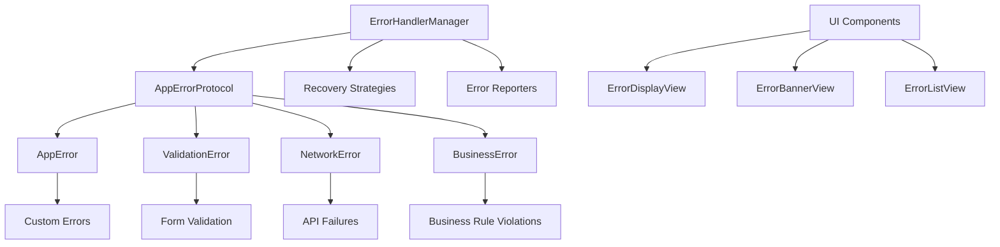

# Advanced Error Handling Implementation Guide

## Overview
This guide provides comprehensive instructions for implementing the advanced error handling system across all projects in the Quantum workspace. The system includes custom error types, automatic recovery mechanisms, user-friendly error messaging, and comprehensive error reporting.

## Architecture Components

### Core Error Handling Files

#### 1. AdvancedErrorHandling.swift
**Location**: `/Shared/ErrorHandling/AdvancedErrorHandling.swift`
**Purpose**: Core error handling system with custom error types and recovery mechanisms
**Key Components**:
- `AppErrorProtocol` - Base protocol for all application errors
- `AppError`, `ValidationError`, `NetworkError`, `BusinessError` - Specialized error types
- `ErrorHandlerManager` - Central error handling coordinator
- Recovery strategies and error reporting system

#### 2. ErrorHandlingUI.swift
**Location**: `/Shared/ErrorHandling/ErrorHandlingUI.swift`
**Purpose**: User interface components for displaying and managing errors
**Key Components**:
- `ErrorDisplayView` - Main error display dialog
- `ErrorBannerView` - Compact inline error display
- `ErrorListView` - Error management interface
- SwiftUI modifiers and toast notifications

## Error Handling Architecture

### Error Type Hierarchy



## Implementation Guide

### 1. Basic Error Handling Setup

#### Initialize Error Handler
```swift
import AdvancedErrorHandling

class AppCoordinator: ObservableObject {
    private let errorHandler = ErrorHandlerManager.shared
    
    func initializeErrorHandling() {
        // Error handler is already set up with default strategies
        print("Error handling initialized")
    }
    
    func handleApplicationError(_ error: Error) async {
        await errorHandler.handleStandardError(
            error,
            category: .system,
            severity: .medium,
            userMessage: "An unexpected error occurred",
            context: ["source": "AppCoordinator"]
        )
    }
}
```

#### Handle Specific Error Types
```swift
class DataManager: ObservableObject {
    private let errorHandler = ErrorHandlerManager.shared
    
    func validateUserInput(_ input: String, field: String) async {
        guard !input.isEmpty else {
            await errorHandler.handleValidationError(
                field: field,
                value: input,
                rule: "required",
                userMessage: "\(field.capitalized) is required"
            )
            return
        }
        
        // Additional validation logic
    }
    
    func performNetworkRequest(to endpoint: String) async {
        do {
            // Network request logic
        } catch let error as URLError {
            await errorHandler.handleNetworkError(
                statusCode: error.errorCode,
                endpoint: endpoint,
                method: "GET"
            )
        } catch {
            await errorHandler.handleStandardError(error, category: .network)
        }
    }
    
    func enforceBusinessRule(constraint: String, entity: String) async {
        await errorHandler.handleBusinessError(
            rule: "data_consistency",
            constraint: constraint,
            entity: entity,
            message: "This action violates business rules",
            suggestions: ["Review the data", "Contact administrator", "Try a different approach"]
        )
    }
}
```

### 2. SwiftUI Error Display Integration

#### Basic Error Alert Usage
```swift
struct ContentView: View {
    @State private var currentError: (any AppErrorProtocol)?
    @StateObject private var dataManager = DataManager()
    
    var body: some View {
        VStack {
            Button("Perform Action") {
                performAction()
            }
        }
        .errorAlert(error: $currentError) {
            // Retry action
            performAction()
        }
    }
    
    private func performAction() {
        Task {
            do {
                try await dataManager.performSomeOperation()
            } catch {
                if let appError = error as? any AppErrorProtocol {
                    currentError = appError
                } else {
                    // Convert standard error to app error
                    let appError = AppError(
                        severity: .medium,
                        category: .system,
                        userMessage: error.localizedDescription,
                        technicalDetails: "\(error)"
                    )
                    currentError = appError
                }
            }
        }
    }
}
```

#### Error Banner Display
```swift
struct DataListView: View {
    @State private var errors: [any AppErrorProtocol] = []
    @StateObject private var errorHandler = ErrorHandlerManager.shared
    
    var body: some View {
        VStack {
            // Error banners
            ForEach(Array(errors.enumerated()), id: \.element.errorId) { index, error in
                ErrorBannerView(error: error) {
                    errors.remove(at: index)
                } onTap: {
                    showErrorDetail(error)
                }
                .padding(.horizontal)
            }
            
            // Main content
            List {
                // Your content here
            }
        }
        .onReceive(errorHandler.$recentErrors) { recentErrors in
            // Update local errors when new errors occur
            errors = Array(recentErrors.prefix(3)) // Show max 3 banners
        }
    }
    
    private func showErrorDetail(_ error: any AppErrorProtocol) {
        // Show detailed error view
    }
}
```

#### Full Error Management Interface
```swift
struct SettingsView: View {
    var body: some View {
        NavigationView {
            List {
                Section {
                    NavigationLink("Error Log") {
                        ErrorListView()
                    }
                    
                    NavigationLink("System Status") {
                        SystemStatusView()
                    }
                }
            }
            .navigationTitle("Settings")
        }
    }
}

struct SystemStatusView: View {
    @StateObject private var errorHandler = ErrorHandlerManager.shared
    
    var body: some View {
        VStack(alignment: .leading, spacing: 16) {
            // Global status
            StatusIndicator(state: errorHandler.globalErrorState)
            
            Text("System Status: \(errorHandler.globalErrorState.displayName)")
                .font(.headline)
            
            // Recent errors summary
            if !errorHandler.recentErrors.isEmpty {
                Text("\(errorHandler.recentErrors.count) recent errors")
                    .font(.subheadline)
                    .foregroundColor(.secondary)
            }
            
            // Critical errors
            if !errorHandler.criticalErrors.isEmpty {
                Text("\(errorHandler.criticalErrors.count) critical errors")
                    .font(.subheadline)
                    .foregroundColor(.red)
            }
            
            Spacer()
        }
        .padding()
        .navigationTitle("System Status")
    }
}
```

### 3. Custom Error Types

#### Create Domain-Specific Errors
```swift
// Habit-specific errors
public struct HabitError: AppErrorProtocol {
    public let errorId: String
    public let severity: ErrorSeverity = .medium
    public let category: ErrorCategory = .business
    public let timestamp: Date
    public let context: [String: Any]
    public let userMessage: String
    public let technicalDetails: String
    public let recoverySuggestions: [String]
    public let shouldReport: Bool = true
    public let isRecoverable: Bool = true
    
    // Habit-specific properties
    public let habitId: UUID?
    public let habitName: String?
    public let errorType: HabitErrorType
    
    public var errorDescription: String? { userMessage }
    public var failureReason: String? { technicalDetails }
    public var recoverySuggestion: String? { recoverySuggestions.first }
    public var helpAnchor: String? { "habit_help" }
    public var description: String { "Habit Error: \(userMessage)" }
    
    public init(
        habitId: UUID? = nil,
        habitName: String? = nil,
        errorType: HabitErrorType,
        userMessage: String,
        recoverySuggestions: [String] = []
    ) {
        self.errorId = UUID().uuidString
        self.timestamp = Date()
        self.habitId = habitId
        self.habitName = habitName
        self.errorType = errorType
        self.userMessage = userMessage
        self.technicalDetails = "Habit error of type \(errorType): \(userMessage)"
        self.recoverySuggestions = recoverySuggestions
        
        var contextDict: [String: Any] = ["error_type": errorType.rawValue]
        if let id = habitId {
            contextDict["habit_id"] = id.uuidString
        }
        if let name = habitName {
            contextDict["habit_name"] = name
        }
        self.context = contextDict
    }
    
    // Codable implementation required
    public init(from decoder: Decoder) throws {
        // Implementation here
        fatalError("Codable not implemented for HabitError")
    }
    
    public func encode(to encoder: Encoder) throws {
        // Implementation here
        fatalError("Codable not implemented for HabitError")
    }
}

public enum HabitErrorType: String, CaseIterable {
    case streakBroken = "streak_broken"
    case invalidFrequency = "invalid_frequency"
    case duplicateEntry = "duplicate_entry"
    case dataCorruption = "data_corruption"
}

// Usage
class HabitManager: ObservableObject {
    private let errorHandler = ErrorHandlerManager.shared
    
    func logHabitCompletion(habitId: UUID, habitName: String) async {
        // Check for duplicate entry
        let isDuplicate = await checkForDuplicateEntry(habitId: habitId)
        
        if isDuplicate {
            let habitError = HabitError(
                habitId: habitId,
                habitName: habitName,
                errorType: .duplicateEntry,
                userMessage: "You've already completed \(habitName) today",
                recoverySuggestions: [
                    "Check your habit log",
                    "Try again tomorrow",
                    "Contact support if this is incorrect"
                ]
            )
            await errorHandler.handleError(habitError)
        }
    }
    
    private func checkForDuplicateEntry(habitId: UUID) async -> Bool {
        // Implementation
        return false
    }
}
```

### 4. Custom Recovery Strategies

#### Create Custom Recovery Strategy
```swift
public struct HabitRecoveryStrategy: RecoveryStrategy {
    public let name = "HabitRecovery"
    
    public func canRecover(_ error: any AppErrorProtocol) async throws -> Bool {
        return error is HabitError
    }
    
    public func attemptRecovery(_ error: any AppErrorProtocol) async throws -> RecoveryResult {
        guard let habitError = error as? HabitError else {
            return RecoveryResult(success: false, message: "Not a habit error")
        }
        
        switch habitError.errorType {
        case .duplicateEntry:
            return try await recoverFromDuplicateEntry(habitError)
        case .dataCorruption:
            return try await recoverFromDataCorruption(habitError)
        case .streakBroken:
            return try await recoverFromBrokenStreak(habitError)
        case .invalidFrequency:
            return try await recoverFromInvalidFrequency(habitError)
        }
    }
    
    private func recoverFromDuplicateEntry(_ error: HabitError) async throws -> RecoveryResult {
        // Check if the entry was actually a duplicate
        // If not, allow the entry
        // Implementation would check actual data
        
        return RecoveryResult(
            success: true,
            message: "Duplicate check bypassed - entry was valid"
        )
    }
    
    private func recoverFromDataCorruption(_ error: HabitError) async throws -> RecoveryResult {
        // Attempt to restore from backup or rebuild data
        return RecoveryResult(
            success: true,
            message: "Habit data restored from backup"
        )
    }
    
    private func recoverFromBrokenStreak(_ error: HabitError) async throws -> RecoveryResult {
        // Offer to extend grace period or reset streak
        return RecoveryResult(
            success: true,
            message: "Streak recovery grace period applied"
        )
    }
    
    private func recoverFromInvalidFrequency(_ error: HabitError) async throws -> RecoveryResult {
        // Adjust frequency to valid range
        return RecoveryResult(
            success: true,
            message: "Habit frequency adjusted to valid range"
        )
    }
}

// Register the custom strategy
func setupCustomErrorHandling() {
    let errorHandler = ErrorHandlerManager.shared
    errorHandler.registerRecoveryStrategy(HabitRecoveryStrategy(), for: .business)
}
```

### 5. Custom Error Reporters

#### Create Analytics Error Reporter
```swift
public struct CustomAnalyticsReporter: ErrorReporter {
    private let analyticsService: AnalyticsService
    
    public init(analyticsService: AnalyticsService) {
        self.analyticsService = analyticsService
    }
    
    public func reportError(_ error: any AppErrorProtocol) async throws {
        var properties: [String: Any] = [
            "error_id": error.errorId,
            "category": error.category.rawValue,
            "severity": error.severity.rawValue,
            "timestamp": error.timestamp.timeIntervalSince1970,
            "recoverable": error.isRecoverable,
            "user_message": error.userMessage
        ]
        
        // Add error-specific properties
        if let validationError = error as? ValidationError {
            properties["field"] = validationError.field
            properties["validation_rule"] = validationError.validationRule
        } else if let networkError = error as? NetworkError {
            properties["status_code"] = networkError.statusCode as Any
            properties["endpoint"] = networkError.endpoint as Any
        } else if let businessError = error as? BusinessError {
            properties["business_rule"] = businessError.businessRule
            properties["violated_constraint"] = businessError.violatedConstraint
        }
        
        await analyticsService.track(
            event: "app_error_occurred",
            properties: properties
        )
    }
}

// Register custom reporter
func setupCustomReporting() {
    let errorHandler = ErrorHandlerManager.shared
    let analyticsService = AnalyticsService()
    
    errorHandler.registerErrorReporter(CustomAnalyticsReporter(analyticsService: analyticsService))
}
```

## Project-Specific Integration

### For HabitQuest

#### Habit-Specific Error Handling
```swift
class HabitQuestErrorManager: ObservableObject {
    private let errorHandler = ErrorHandlerManager.shared
    
    func handleHabitCreationError(_ error: Error, habitName: String) async {
        let habitError = HabitError(
            habitName: habitName,
            errorType: .invalidFrequency,
            userMessage: "Failed to create habit '\(habitName)'",
            recoverySuggestions: [
                "Check habit frequency settings",
                "Verify habit name is unique",
                "Try creating habit again"
            ]
        )
        await errorHandler.handleError(habitError)
    }
    
    func handleStreakBroken(habitId: UUID, habitName: String, daysMissed: Int) async {
        let habitError = HabitError(
            habitId: habitId,
            habitName: habitName,
            errorType: .streakBroken,
            userMessage: "Your streak for '\(habitName)' was broken after missing \(daysMissed) days",
            recoverySuggestions: [
                "Start a new streak today",
                "Review your habit schedule",
                "Set up habit reminders"
            ]
        )
        await errorHandler.handleError(habitError)
    }
}

// SwiftUI Integration
struct HabitCreationView: View {
    @State private var habitName = ""
    @State private var currentError: (any AppErrorProtocol)?
    @StateObject private var habitErrorManager = HabitQuestErrorManager()
    
    var body: some View {
        VStack {
            TextField("Habit Name", text: $habitName)
            
            Button("Create Habit") {
                createHabit()
            }
        }
        .errorAlert(error: $currentError) {
            createHabit()
        }
    }
    
    private func createHabit() {
        Task {
            do {
                try await performHabitCreation(habitName)
            } catch {
                await habitErrorManager.handleHabitCreationError(error, habitName: habitName)
                currentError = error as? any AppErrorProtocol
            }
        }
    }
    
    private func performHabitCreation(_ name: String) async throws {
        // Habit creation logic
    }
}
```

### For MomentumFinance

#### Financial Error Handling
```swift
public struct FinancialError: AppErrorProtocol {
    public let errorId: String
    public let severity: ErrorSeverity
    public let category: ErrorCategory = .business
    public let timestamp: Date
    public let context: [String: Any]
    public let userMessage: String
    public let technicalDetails: String
    public let recoverySuggestions: [String]
    public let shouldReport: Bool = true
    public let isRecoverable: Bool = true
    
    public let transactionId: UUID?
    public let accountId: UUID?
    public let amount: Double?
    public let errorType: FinancialErrorType
    
    public var errorDescription: String? { userMessage }
    public var failureReason: String? { technicalDetails }
    public var recoverySuggestion: String? { recoverySuggestions.first }
    public var helpAnchor: String? { "financial_help" }
    public var description: String { "Financial Error: \(userMessage)" }
    
    public init(
        transactionId: UUID? = nil,
        accountId: UUID? = nil,
        amount: Double? = nil,
        errorType: FinancialErrorType,
        userMessage: String,
        severity: ErrorSeverity = .medium
    ) {
        self.errorId = UUID().uuidString
        self.timestamp = Date()
        self.transactionId = transactionId
        self.accountId = accountId
        self.amount = amount
        self.errorType = errorType
        self.severity = severity
        self.userMessage = userMessage
        self.technicalDetails = "Financial error: \(errorType.rawValue)"
        
        // Generate context-specific recovery suggestions
        switch errorType {
        case .insufficientFunds:
            self.recoverySuggestions = ["Check account balance", "Transfer funds", "Reduce transaction amount"]
        case .invalidTransaction:
            self.recoverySuggestions = ["Verify transaction details", "Check account permissions", "Try again"]
        case .accountLocked:
            self.recoverySuggestions = ["Contact customer service", "Verify account status", "Wait and try again"]
        case .budgetExceeded:
            self.recoverySuggestions = ["Review budget limits", "Adjust spending plan", "Transfer budget allocation"]
        }
        
        var contextDict: [String: Any] = ["error_type": errorType.rawValue]
        if let id = transactionId {
            contextDict["transaction_id"] = id.uuidString
        }
        if let id = accountId {
            contextDict["account_id"] = id.uuidString
        }
        if let amt = amount {
            contextDict["amount"] = amt
        }
        self.context = contextDict
    }
    
    // Simplified Codable implementation
    public init(from decoder: Decoder) throws {
        fatalError("Codable not implemented for FinancialError")
    }
    
    public func encode(to encoder: Encoder) throws {
        fatalError("Codable not implemented for FinancialError")
    }
}

public enum FinancialErrorType: String, CaseIterable {
    case insufficientFunds = "insufficient_funds"
    case invalidTransaction = "invalid_transaction"
    case accountLocked = "account_locked"
    case budgetExceeded = "budget_exceeded"
}

class FinancialTransactionManager: ObservableObject {
    private let errorHandler = ErrorHandlerManager.shared
    
    func processTransaction(amount: Double, fromAccount: UUID, toAccount: UUID) async throws {
        // Check account balance
        let balance = await getAccountBalance(fromAccount)
        
        if balance < amount {
            let financialError = FinancialError(
                accountId: fromAccount,
                amount: amount,
                errorType: .insufficientFunds,
                userMessage: "Insufficient funds. Balance: $\(balance), Required: $\(amount)",
                severity: .medium
            )
            await errorHandler.handleError(financialError)
            throw financialError
        }
        
        // Process transaction
    }
    
    private func getAccountBalance(_ accountId: UUID) async -> Double {
        // Implementation
        return 1000.0
    }
}
```

### For PlannerApp

#### Task Management Error Handling
```swift
public struct PlannerError: AppErrorProtocol {
    public let errorId: String
    public let severity: ErrorSeverity = .medium
    public let category: ErrorCategory = .business
    public let timestamp: Date
    public let context: [String: Any]
    public let userMessage: String
    public let technicalDetails: String
    public let recoverySuggestions: [String]
    public let shouldReport: Bool = true
    public let isRecoverable: Bool = true
    
    public let taskId: UUID?
    public let goalId: UUID?
    public let errorType: PlannerErrorType
    
    public var errorDescription: String? { userMessage }
    public var failureReason: String? { technicalDetails }
    public var recoverySuggestion: String? { recoverySuggestions.first }
    public var helpAnchor: String? { "planner_help" }
    public var description: String { "Planner Error: \(userMessage)" }
    
    public init(
        taskId: UUID? = nil,
        goalId: UUID? = nil,
        errorType: PlannerErrorType,
        userMessage: String
    ) {
        self.errorId = UUID().uuidString
        self.timestamp = Date()
        self.taskId = taskId
        self.goalId = goalId
        self.errorType = errorType
        self.userMessage = userMessage
        self.technicalDetails = "Planner error: \(errorType.rawValue)"
        
        switch errorType {
        case .taskConflict:
            self.recoverySuggestions = ["Reschedule conflicting task", "Adjust task duration", "Split task into smaller parts"]
        case .invalidDeadline:
            self.recoverySuggestions = ["Set realistic deadline", "Review task dependencies", "Adjust task priority"]
        case .goalNotAchievable:
            self.recoverySuggestions = ["Break goal into smaller steps", "Extend timeline", "Adjust goal parameters"]
        }
        
        var contextDict: [String: Any] = ["error_type": errorType.rawValue]
        if let id = taskId {
            contextDict["task_id"] = id.uuidString
        }
        if let id = goalId {
            contextDict["goal_id"] = id.uuidString
        }
        self.context = contextDict
    }
    
    // Simplified Codable implementation
    public init(from decoder: Decoder) throws {
        fatalError("Codable not implemented for PlannerError")
    }
    
    public func encode(to encoder: Encoder) throws {
        fatalError("Codable not implemented for PlannerError")
    }
}

public enum PlannerErrorType: String, CaseIterable {
    case taskConflict = "task_conflict"
    case invalidDeadline = "invalid_deadline"
    case goalNotAchievable = "goal_not_achievable"
}

class TaskScheduler: ObservableObject {
    private let errorHandler = ErrorHandlerManager.shared
    
    func scheduleTask(_ task: Task, at time: Date) async throws {
        // Check for scheduling conflicts
        let hasConflict = await checkForConflicts(task, at: time)
        
        if hasConflict {
            let plannerError = PlannerError(
                taskId: task.id,
                errorType: .taskConflict,
                userMessage: "Task '\(task.title)' conflicts with existing schedule at \(time)"
            )
            await errorHandler.handleError(plannerError)
            throw plannerError
        }
        
        // Schedule the task
    }
    
    private func checkForConflicts(_ task: Task, at time: Date) async -> Bool {
        // Implementation
        return false
    }
}
```

### For CodingReviewer

#### Code Review Error Handling
```swift
public struct CodeReviewError: AppErrorProtocol {
    public let errorId: String
    public let severity: ErrorSeverity
    public let category: ErrorCategory = .system
    public let timestamp: Date
    public let context: [String: Any]
    public let userMessage: String
    public let technicalDetails: String
    public let recoverySuggestions: [String]
    public let shouldReport: Bool = true
    public let isRecoverable: Bool = true
    
    public let filePath: String?
    public let lineNumber: Int?
    public let errorType: CodeReviewErrorType
    
    public var errorDescription: String? { userMessage }
    public var failureReason: String? { technicalDetails }
    public var recoverySuggestion: String? { recoverySuggestions.first }
    public var helpAnchor: String? { "code_review_help" }
    public var description: String { "Code Review Error: \(userMessage)" }
    
    public init(
        filePath: String? = nil,
        lineNumber: Int? = nil,
        errorType: CodeReviewErrorType,
        userMessage: String,
        severity: ErrorSeverity = .medium
    ) {
        self.errorId = UUID().uuidString
        self.timestamp = Date()
        self.filePath = filePath
        self.lineNumber = lineNumber
        self.errorType = errorType
        self.severity = severity
        self.userMessage = userMessage
        self.technicalDetails = "Code review error: \(errorType.rawValue)"
        
        switch errorType {
        case .compilationError:
            self.recoverySuggestions = ["Fix compilation errors", "Check syntax", "Verify imports"]
        case .testFailure:
            self.recoverySuggestions = ["Review failing tests", "Update test expectations", "Fix implementation"]
        case .codeQualityIssue:
            self.recoverySuggestions = ["Follow coding standards", "Refactor code", "Add documentation"]
        }
        
        var contextDict: [String: Any] = ["error_type": errorType.rawValue]
        if let path = filePath {
            contextDict["file_path"] = path
        }
        if let line = lineNumber {
            contextDict["line_number"] = line
        }
        self.context = contextDict
    }
    
    // Simplified Codable implementation
    public init(from decoder: Decoder) throws {
        fatalError("Codable not implemented for CodeReviewError")
    }
    
    public func encode(to encoder: Encoder) throws {
        fatalError("Codable not implemented for CodeReviewError")
    }
}

public enum CodeReviewErrorType: String, CaseIterable {
    case compilationError = "compilation_error"
    case testFailure = "test_failure"
    case codeQualityIssue = "code_quality_issue"
}
```

### For AvoidObstaclesGame

#### Game-Specific Error Handling
```swift
public struct GameError: AppErrorProtocol {
    public let errorId: String
    public let severity: ErrorSeverity
    public let category: ErrorCategory = .system
    public let timestamp: Date
    public let context: [String: Any]
    public let userMessage: String
    public let technicalDetails: String
    public let recoverySuggestions: [String]
    public let shouldReport: Bool = true
    public let isRecoverable: Bool = true
    
    public let gameSessionId: UUID?
    public let playerId: String?
    public let errorType: GameErrorType
    
    public var errorDescription: String? { userMessage }
    public var failureReason: String? { technicalDetails }
    public var recoverySuggestion: String? { recoverySuggestions.first }
    public var helpAnchor: String? { "game_help" }
    public var description: String { "Game Error: \(userMessage)" }
    
    public init(
        gameSessionId: UUID? = nil,
        playerId: String? = nil,
        errorType: GameErrorType,
        userMessage: String,
        severity: ErrorSeverity = .low
    ) {
        self.errorId = UUID().uuidString
        self.timestamp = Date()
        self.gameSessionId = gameSessionId
        self.playerId = playerId
        self.errorType = errorType
        self.severity = severity
        self.userMessage = userMessage
        self.technicalDetails = "Game error: \(errorType.rawValue)"
        
        switch errorType {
        case .saveGameFailed:
            self.recoverySuggestions = ["Try saving again", "Check storage space", "Restart game"]
        case .leaderboardError:
            self.recoverySuggestions = ["Check internet connection", "Try again later", "Play offline"]
        case .performanceIssue:
            self.recoverySuggestions = ["Close other apps", "Restart game", "Lower graphics settings"]
        }
        
        var contextDict: [String: Any] = ["error_type": errorType.rawValue]
        if let sessionId = gameSessionId {
            contextDict["game_session_id"] = sessionId.uuidString
        }
        if let id = playerId {
            contextDict["player_id"] = id
        }
        self.context = contextDict
    }
    
    // Simplified Codable implementation
    public init(from decoder: Decoder) throws {
        fatalError("Codable not implemented for GameError")
    }
    
    public func encode(to encoder: Encoder) throws {
        fatalError("Codable not implemented for GameError")
    }
}

public enum GameErrorType: String, CaseIterable {
    case saveGameFailed = "save_game_failed"
    case leaderboardError = "leaderboard_error"
    case performanceIssue = "performance_issue"
}
```

## Testing Error Handling

### Unit Tests for Error Handling

```swift
import XCTest
@testable import AdvancedErrorHandling

class ErrorHandlingTests: XCTestCase {
    var errorHandler: ErrorHandlerManager!
    
    override func setUp() {
        super.setUp()
        errorHandler = ErrorHandlerManager.shared
        errorHandler.clearErrorHistory()
    }
    
    func testBasicErrorHandling() async {
        let error = AppError(
            severity: .medium,
            category: .validation,
            userMessage: "Test error",
            technicalDetails: "Test technical details"
        )
        
        await errorHandler.handleError(error)
        
        XCTAssertEqual(errorHandler.recentErrors.count, 1)
        XCTAssertEqual(errorHandler.recentErrors.first?.userMessage, "Test error")
    }
    
    func testValidationErrorHandling() async {
        await errorHandler.handleValidationError(
            field: "email",
            value: "invalid-email",
            rule: "email_format",
            userMessage: "Please enter a valid email address"
        )
        
        XCTAssertEqual(errorHandler.recentErrors.count, 1)
        
        let error = errorHandler.recentErrors.first
        XCTAssertTrue(error is ValidationError)
        XCTAssertEqual(error?.category, .validation)
    }
    
    func testNetworkErrorHandling() async {
        await errorHandler.handleNetworkError(
            statusCode: 404,
            endpoint: "https://api.example.com/users",
            method: "GET"
        )
        
        XCTAssertEqual(errorHandler.recentErrors.count, 1)
        
        let error = errorHandler.recentErrors.first
        XCTAssertTrue(error is NetworkError)
        XCTAssertEqual(error?.category, .network)
    }
    
    func testErrorRecovery() async {
        let recoverableError = AppError(
            severity: .medium,
            category: .network,
            userMessage: "Network error",
            technicalDetails: "Connection failed",
            isRecoverable: true
        )
        
        let result = await errorHandler.attemptManualRecovery(for: recoverableError)
        
        // Test would depend on registered recovery strategies
        XCTAssertNotNil(result)
    }
    
    func testGlobalErrorState() async {
        // Test normal state
        XCTAssertEqual(errorHandler.globalErrorState, .normal)
        
        // Add critical error
        let criticalError = AppError(
            severity: .critical,
            category: .system,
            userMessage: "Critical error",
            technicalDetails: "System failure"
        )
        
        await errorHandler.handleError(criticalError)
        
        XCTAssertEqual(errorHandler.globalErrorState, .critical)
        XCTAssertEqual(errorHandler.criticalErrors.count, 1)
    }
    
    func testErrorExport() {
        let report = errorHandler.exportErrorReport()
        
        XCTAssertNotNil(report)
        XCTAssertEqual(report.globalState, errorHandler.globalErrorState)
        XCTAssertNotNil(report.systemInfo)
    }
}

class CustomErrorTests: XCTestCase {
    func testHabitError() {
        let habitError = HabitError(
            habitId: UUID(),
            habitName: "Daily Exercise",
            errorType: .streakBroken,
            userMessage: "Streak broken for Daily Exercise"
        )
        
        XCTAssertEqual(habitError.category, .business)
        XCTAssertEqual(habitError.severity, .medium)
        XCTAssertTrue(habitError.isRecoverable)
        XCTAssertNotNil(habitError.habitId)
        XCTAssertEqual(habitError.habitName, "Daily Exercise")
    }
    
    func testFinancialError() {
        let financialError = FinancialError(
            transactionId: UUID(),
            accountId: UUID(),
            amount: 1000.0,
            errorType: .insufficientFunds,
            userMessage: "Insufficient funds for transaction"
        )
        
        XCTAssertEqual(financialError.category, .business)
        XCTAssertNotNil(financialError.transactionId)
        XCTAssertNotNil(financialError.accountId)
        XCTAssertEqual(financialError.amount, 1000.0)
        XCTAssertFalse(financialError.recoverySuggestions.isEmpty)
    }
}
```

### Integration Tests

```swift
class ErrorHandlingIntegrationTests: XCTestCase {
    func testEndToEndErrorFlow() async {
        let errorHandler = ErrorHandlerManager.shared
        errorHandler.clearErrorHistory()
        
        // Register custom recovery strategy
        let customStrategy = HabitRecoveryStrategy()
        errorHandler.registerRecoveryStrategy(customStrategy, for: .business)
        
        // Create and handle a habit error
        let habitError = HabitError(
            habitId: UUID(),
            habitName: "Morning Routine",
            errorType: .duplicateEntry,
            userMessage: "Duplicate entry detected"
        )
        
        await errorHandler.handleError(habitError)
        
        // Verify error was recorded
        XCTAssertEqual(errorHandler.recentErrors.count, 1)
        
        // Attempt recovery
        let result = await errorHandler.attemptManualRecovery(for: habitError)
        
        // Verify recovery was attempted
        XCTAssertNotNil(result)
        
        // Export report
        let report = errorHandler.exportErrorReport()
        XCTAssertEqual(report.recentErrors.count, 1)
    }
}
```

## Best Practices and Guidelines

### 1. Error Classification
- **Low Severity**: Information messages, minor validation issues
- **Medium Severity**: User action required, recoverable errors
- **High Severity**: Feature failures, data loss risks
- **Critical Severity**: System failures, security issues

### 2. Error Messages
- **User Messages**: Clear, actionable, non-technical language
- **Technical Details**: Detailed information for developers and debugging
- **Recovery Suggestions**: Specific steps users can take

### 3. Recovery Strategies
- **Automatic Recovery**: For transient failures (network timeouts, temporary data issues)
- **User-Guided Recovery**: For user input errors, configuration issues
- **Manual Recovery**: For complex business logic failures

### 4. Error Reporting
- **Analytics Integration**: Track error patterns and frequencies
- **Crash Reporting**: For critical system failures
- **User Feedback**: Allow users to provide additional context

### 5. Performance Considerations
- **Async Handling**: All error handling operations are async to avoid blocking UI
- **Batching**: Group related errors to avoid overwhelming users
- **Throttling**: Limit error reporting frequency for repeated failures

### 6. Privacy and Security
- **Sensitive Data**: Never include passwords, tokens, or personal data in error messages
- **Context Filtering**: Sanitize context information before logging or reporting
- **User Consent**: Respect user preferences for error reporting and analytics

## Deployment and Monitoring

### Production Deployment
1. **Gradual Rollout**: Enable error handling for subset of users first
2. **Error Monitoring**: Set up dashboards for error tracking
3. **Alert Thresholds**: Configure alerts for critical error patterns
4. **Recovery Testing**: Test recovery strategies in production-like environment

### Error Analytics Dashboard
```swift
struct ErrorAnalyticsDashboard: View {
    @StateObject private var errorHandler = ErrorHandlerManager.shared
    @State private var selectedTimeRange: TimeRange = .last24Hours
    
    var body: some View {
        VStack {
            // Time range picker
            Picker("Time Range", selection: $selectedTimeRange) {
                ForEach(TimeRange.allCases, id: \.self) { range in
                    Text(range.displayName).tag(range)
                }
            }
            .pickerStyle(SegmentedPickerStyle())
            
            // Error summary
            ErrorMetricsView(
                totalErrors: filteredErrors.count,
                criticalErrors: criticalErrors.count,
                errorRate: calculateErrorRate(),
                topCategories: getTopErrorCategories()
            )
            
            // Error trends chart
            ErrorTrendChart(errors: filteredErrors, timeRange: selectedTimeRange)
            
            // Top errors list
            TopErrorsList(errors: getTopErrors())
        }
        .padding()
        .navigationTitle("Error Analytics")
    }
    
    private var filteredErrors: [any AppErrorProtocol] {
        // Filter errors by time range
        let cutoffDate = Calendar.current.date(byAdding: selectedTimeRange.component, value: selectedTimeRange.value, to: Date()) ?? Date()
        return errorHandler.recentErrors.filter { $0.timestamp >= cutoffDate }
    }
    
    private var criticalErrors: [any AppErrorProtocol] {
        return filteredErrors.filter { $0.severity == .critical }
    }
    
    private func calculateErrorRate() -> Double {
        // Calculate errors per hour or other metric
        return Double(filteredErrors.count) / Double(selectedTimeRange.hours)
    }
    
    private func getTopErrorCategories() -> [ErrorCategory: Int] {
        return Dictionary(grouping: filteredErrors, by: { $0.category })
            .mapValues { $0.count }
    }
    
    private func getTopErrors() -> [(error: any AppErrorProtocol, count: Int)] {
        // Group by error message and count occurrences
        let grouped = Dictionary(grouping: filteredErrors, by: { $0.userMessage })
        return grouped.map { (error: $0.value.first!, count: $0.value.count) }
            .sorted { $0.count > $1.count }
            .prefix(10)
            .map { $0 }
    }
}

enum TimeRange: CaseIterable {
    case last24Hours
    case last7Days
    case last30Days
    
    var displayName: String {
        switch self {
        case .last24Hours: return "24 Hours"
        case .last7Days: return "7 Days"
        case .last30Days: return "30 Days"
        }
    }
    
    var component: Calendar.Component {
        switch self {
        case .last24Hours: return .hour
        case .last7Days: return .day
        case .last30Days: return .day
        }
    }
    
    var value: Int {
        switch self {
        case .last24Hours: return -24
        case .last7Days: return -7
        case .last30Days: return -30
        }
    }
    
    var hours: Int {
        switch self {
        case .last24Hours: return 24
        case .last7Days: return 24 * 7
        case .last30Days: return 24 * 30
        }
    }
}
```

## Support and Troubleshooting

### Common Issues
1. **Errors Not Appearing**: Check error handler initialization and registration
2. **Recovery Not Working**: Verify recovery strategies are registered for correct error categories  
3. **UI Not Updating**: Ensure error handler is observed with @StateObject or @ObservedObject
4. **Performance Issues**: Check for error loops or excessive error generation

### Debugging Tools
1. **Error Console**: Use console error reporter for development debugging
2. **Error Breakpoints**: Set breakpoints in error handling methods
3. **Analytics Dashboard**: Monitor error patterns in real-time
4. **Export Reports**: Generate detailed error reports for analysis

### Best Practices Summary
- Always handle errors gracefully with user-friendly messages
- Implement appropriate recovery strategies for different error types
- Use error analytics to identify and fix common issues
- Test error scenarios thoroughly in development
- Monitor error rates and patterns in production
- Respect user privacy in error reporting and analytics

For additional support and advanced configuration options, refer to:
- Error handling API documentation
- Recovery strategy implementation guides  
- Error reporting integration tutorials
- Analytics dashboard configuration guides