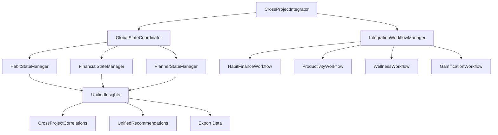

# Cross-Project Integration Implementation Guide

## Overview
This guide provides comprehensive instructions for implementing unified data sharing, cross-project analytics, and coordinated workflows across all projects in the Quantum workspace using the Cross-Project Integration system.

## Architecture Components

### Core Integration Files

#### 1. CrossProjectIntegration.swift
**Location**: `/Shared/Integration/CrossProjectIntegration.swift`
**Purpose**: Main coordinator for cross-project integration and data sharing
**Key Components**:
- `CrossProjectIntegrator` - Main integration coordinator
- `UnifiedUserInsights` - Consolidated insights across all projects
- `CrossProjectCorrelation` - Statistical correlations between projects
- Export functionality with multiple formats (JSON, CSV, XML, SQLite)

#### 2. IntegrationWorkflows.swift
**Location**: `/Shared/Integration/IntegrationWorkflows.swift`
**Purpose**: Automated workflows for cross-project coordination
**Key Components**:
- `IntegrationWorkflowManager` - Manages automated workflows
- Workflow implementations (Habit-Finance, Productivity, Wellness, Gamification)
- Analysis and optimization algorithms

## Integration Architecture

### Core Integration Flow



## Implementation Guide

### 1. Basic Integration Setup

#### Initialize Cross-Project Integration
```swift
import CrossProjectIntegration

class AppCoordinator: ObservableObject {
    private let integrator = CrossProjectIntegrator.shared
    private let workflowManager = IntegrationWorkflowManager.shared
    
    func initializeIntegration() async {
        do {
            try await integrator.initializeIntegration()
            print("Cross-project integration initialized")
            
            // Connect available projects
            try await integrator.connectProject(.habitQuest)
            try await integrator.connectProject(.momentumFinance)
            try await integrator.connectProject(.plannerApp)
            
        } catch {
            print("Integration initialization failed: \(error)")
        }
    }
}
```

#### Monitor Integration Status
```swift
class IntegrationDashboard: UIViewController {
    @IBOutlet weak var statusLabel: UILabel!
    @IBOutlet weak var connectedProjectsLabel: UILabel!
    
    private let integrator = CrossProjectIntegrator.shared
    private var cancellables = Set<AnyCancellable>()
    
    override func viewDidLoad() {
        super.viewDidLoad()
        setupIntegrationObservation()
    }
    
    private func setupIntegrationObservation() {
        integrator.$integrationHealth
            .sink { [weak self] health in
                self?.updateHealthStatus(health)
            }
            .store(in: &cancellables)
        
        integrator.$connectedProjects
            .sink { [weak self] projects in
                self?.connectedProjectsLabel.text = "Connected: \(projects.count) projects"
            }
            .store(in: &cancellables)
    }
    
    private func updateHealthStatus(_ health: IntegrationHealthStatus) {
        switch health {
        case .healthy:
            statusLabel.text = "✅ Integration Healthy"
            statusLabel.textColor = .systemGreen
        case .warning(let message):
            statusLabel.text = "⚠️ Warning: \(message)"
            statusLabel.textColor = .systemOrange
        case .error(let error):
            statusLabel.text = "❌ Error: \(error.localizedDescription)"
            statusLabel.textColor = .systemRed
        case .disconnected:
            statusLabel.text = "⚪ Disconnected"
            statusLabel.textColor = .systemGray
        }
    }
}
```

### 2. Unified Insights Generation

#### Generate Cross-Project Insights
```swift
class InsightsViewController: UIViewController {
    @IBOutlet weak var insightsTableView: UITableView!
    
    private let integrator = CrossProjectIntegrator.shared
    private var insights: UnifiedUserInsights?
    
    func generateInsights() async {
        do {
            try await integrator.generateUnifiedInsights(for: getCurrentUserId())
            
            if let unifiedInsights = integrator.unifiedInsights {
                self.insights = unifiedInsights
                
                DispatchQueue.main.async {
                    self.updateInsightsUI(unifiedInsights)
                }
            }
        } catch {
            showError("Failed to generate insights: \(error.localizedDescription)")
        }
    }
    
    private func updateInsightsUI(_ insights: UnifiedUserInsights) {
        // Update UI with insights
        insightsTableView.reloadData()
        
        // Display overall score
        displayOverallScore(insights.overallScore)
        
        // Show cross-project correlations
        displayCorrelations(insights.crossProjectCorrelations)
        
        // Present recommendations
        displayRecommendations(insights.recommendations)
    }
}
```

#### SwiftUI Insights View
```swift
struct UnifiedInsightsView: View {
    @StateObject private var integrator = CrossProjectIntegrator.shared
    @State private var isLoading = false
    @State private var userId = "current_user"
    
    var body: some View {
        NavigationView {
            VStack {
                if let insights = integrator.unifiedInsights {
                    InsightsDetailView(insights: insights)
                } else if isLoading {
                    ProgressView("Generating insights...")
                } else {
                    EmptyInsightsView()
                }
            }
            .navigationTitle("Unified Insights")
            .toolbar {
                ToolbarItem(placement: .navigationBarTrailing) {
                    Button("Generate") {
                        Task {
                            isLoading = true
                            defer { isLoading = false }
                            
                            try? await integrator.generateUnifiedInsights(for: userId)
                        }
                    }
                }
            }
        }
    }
}

struct InsightsDetailView: View {
    let insights: UnifiedUserInsights
    
    var body: some View {
        ScrollView {
            LazyVStack(spacing: 16) {
                // Overall Score Card
                OverallScoreCard(score: insights.overallScore)
                
                // Habit Insights
                if !insights.habitInsights.isEmpty {
                    HabitInsightsCard(insights: insights.habitInsights)
                }
                
                // Financial Insights
                if let financialInsights = insights.financialInsights {
                    FinancialInsightsCard(insights: financialInsights)
                }
                
                // Productivity Insights
                ProductivityInsightsCard(insights: insights.productivityInsights)
                
                // Cross-Project Correlations
                if !insights.crossProjectCorrelations.isEmpty {
                    CorrelationsCard(correlations: insights.crossProjectCorrelations)
                }
                
                // Unified Recommendations
                if !insights.recommendations.isEmpty {
                    RecommendationsCard(recommendations: insights.recommendations)
                }
            }
            .padding()
        }
    }
}
```

### 3. Cross-Project Workflows

#### Start Automated Workflows
```swift
class WorkflowManager: ObservableObject {
    private let workflowManager = IntegrationWorkflowManager.shared
    
    func startHabitFinanceIntegration() async {
        let workflow = IntegrationWorkflow(
            id: UUID(),
            type: .habitFinanceIntegration,
            title: "Habit-Finance Integration",
            description: "Integrate habit tracking with financial goals",
            requiredProjects: [.habitQuest, .momentumFinance],
            parameters: [:],
            schedule: .daily,
            createdAt: Date()
        )
        
        do {
            try await workflowManager.startWorkflow(workflow)
            print("Habit-Finance integration workflow started")
        } catch {
            print("Workflow failed: \(error)")
        }
    }
    
    func startProductivityOptimization() async {
        let workflow = IntegrationWorkflow(
            id: UUID(),
            type: .productivityOptimization,
            title: "Productivity Optimization",
            description: "Optimize productivity across all projects",
            requiredProjects: [.habitQuest, .plannerApp],
            parameters: ["optimization_level": "aggressive"],
            schedule: .daily,
            createdAt: Date()
        )
        
        try? await workflowManager.startWorkflow(workflow)
    }
    
    func startWellnessIntegration() async {
        let workflow = IntegrationWorkflow(
            id: UUID(),
            type: .wellnessIntegration,
            title: "Wellness Integration",
            description: "Integrate wellness tracking across all projects",
            requiredProjects: [.habitQuest, .plannerApp, .avoidObstaclesGame],
            parameters: [:],
            schedule: .weekly,
            createdAt: Date()
        )
        
        try? await workflowManager.startWorkflow(workflow)
    }
}
```

#### Monitor Workflow Results
```swift
struct WorkflowDashboardView: View {
    @StateObject private var workflowManager = IntegrationWorkflowManager.shared
    
    var body: some View {
        NavigationView {
            List {
                Section("Active Workflows") {
                    ForEach(workflowManager.activeWorkflows) { workflow in
                        WorkflowRowView(workflow: workflow)
                    }
                }
                
                Section("Completed Workflows") {
                    ForEach(Array(workflowManager.workflowResults.keys), id: \.self) { workflowId in
                        if let result = workflowManager.workflowResults[workflowId] {
                            WorkflowResultRowView(result: result)
                        }
                    }
                }
            }
            .navigationTitle("Integration Workflows")
        }
    }
}
```

### 4. Data Export and Synchronization

#### Export Unified Data
```swift
class DataExporter: ObservableObject {
    private let integrator = CrossProjectIntegrator.shared
    
    func exportUnifiedData(for userId: String, format: ExportFormat) async -> Data? {
        do {
            let data = try await integrator.exportUnifiedData(for: userId, format: format)
            return data
        } catch {
            print("Export failed: \(error)")
            return nil
        }
    }
    
    func exportToFile(userId: String, format: ExportFormat) async {
        guard let data = await exportUnifiedData(for: userId, format: format) else {
            return
        }
        
        let filename = "unified_data_\(userId)_\(Date().timeIntervalSince1970).\(format.fileExtension)"
        
        // Save to documents directory
        if let documentsDirectory = FileManager.default.urls(for: .documentDirectory, in: .userDomainMask).first {
            let fileURL = documentsDirectory.appendingPathComponent(filename)
            
            do {
                try data.write(to: fileURL)
                print("Data exported to: \(fileURL)")
            } catch {
                print("Failed to write file: \(error)")
            }
        }
    }
    
    func shareUnifiedData(userId: String, format: ExportFormat, from viewController: UIViewController) async {
        guard let data = await exportUnifiedData(for: userId, format: format) else {
            return
        }
        
        let filename = "unified_data.\(format.fileExtension)"
        let tempURL = FileManager.default.temporaryDirectory.appendingPathComponent(filename)
        
        do {
            try data.write(to: tempURL)
            
            let activityViewController = UIActivityViewController(
                activityItems: [tempURL],
                applicationActivities: nil
            )
            
            viewController.present(activityViewController, animated: true)
        } catch {
            print("Failed to share data: \(error)")
        }
    }
}
```

#### Sync Between Projects
```swift
class ProjectSynchronizer: ObservableObject {
    private let integrator = CrossProjectIntegrator.shared
    
    func syncAllProjects() async {
        for sourceProject in integrator.connectedProjects {
            for targetProject in integrator.connectedProjects {
                if sourceProject != targetProject {
                    do {
                        try await integrator.syncBetweenProjects(from: sourceProject, to: targetProject)
                    } catch {
                        print("Sync failed from \(sourceProject) to \(targetProject): \(error)")
                    }
                }
            }
        }
    }
    
    func syncSpecificProjects(from source: ProjectType, to target: ProjectType) async {
        do {
            try await integrator.syncBetweenProjects(from: source, to: target)
            print("Successfully synced from \(source.displayName) to \(target.displayName)")
        } catch {
            print("Sync failed: \(error)")
        }
    }
}
```

## Project-Specific Integration

### For HabitQuest

#### Integration Dashboard
```swift
class HabitQuestIntegrationViewController: UIViewController {
    private let integrator = CrossProjectIntegrator.shared
    
    override func viewDidLoad() {
        super.viewDidLoad()
        setupIntegrationFeatures()
    }
    
    private func setupIntegrationFeatures() {
        // Financial habit suggestions
        addFinancialHabitSection()
        
        // Productivity habit recommendations
        addProductivityHabitSection()
        
        // Wellness integration
        addWellnessIntegrationSection()
        
        // Game achievements from other projects
        addCrossProjectAchievements()
    }
    
    private func addFinancialHabitSection() {
        // Display habits suggested based on financial data
        if integrator.connectedProjects.contains(.momentumFinance) {
            // Show financial habit recommendations
        }
    }
    
    @IBAction func generateFinancialHabits() {
        Task {
            let workflowManager = IntegrationWorkflowManager.shared
            let workflow = IntegrationWorkflow(
                id: UUID(),
                type: .habitFinanceIntegration,
                title: "Generate Financial Habits",
                description: "Create habits based on financial patterns",
                requiredProjects: [.habitQuest, .momentumFinance],
                parameters: [:],
                schedule: .manual,
                createdAt: Date()
            )
            
            try? await workflowManager.startWorkflow(workflow)
        }
    }
}
```

### For MomentumFinance

#### Cross-Project Financial Planning
```swift
class FinancialPlanningViewController: UIViewController {
    private let integrator = CrossProjectIntegrator.shared
    
    func createHabitBasedBudget() async {
        // Use habit data to create more accurate budgets
        if let insights = integrator.unifiedInsights {
            let habitInsights = insights.habitInsights
            
            // Analyze spending habits and create budget recommendations
            for habitInsight in habitInsights {
                if habitInsight.completionRate > 0.8 {
                    // Create budget categories for successful habits
                    await createBudgetCategory(for: habitInsight)
                }
            }
        }
    }
    
    func generateTasksFromFinancialGoals() async {
        // Create planner tasks based on financial recommendations
        let workflowManager = IntegrationWorkflowManager.shared
        
        let workflow = IntegrationWorkflow(
            id: UUID(),
            type: .habitFinanceIntegration,
            title: "Financial Task Generation",
            description: "Generate tasks from financial recommendations",
            requiredProjects: [.momentumFinance, .plannerApp],
            parameters: [:],
            schedule: .manual,
            createdAt: Date()
        )
        
        try? await workflowManager.startWorkflow(workflow)
    }
    
    private func createBudgetCategory(for habitInsight: HabitInsights) async {
        // Implementation for creating budget categories based on habits
    }
}
```

### For PlannerApp

#### Intelligent Task Scheduling
```swift
class IntelligentScheduler: ObservableObject {
    private let integrator = CrossProjectIntegrator.shared
    
    func optimizeScheduleWithCrossProjectData() async {
        guard let insights = integrator.unifiedInsights else { return }
        
        // Use habit completion patterns for optimal scheduling
        let habitInsights = insights.habitInsights
        let productivityInsights = insights.productivityInsights
        
        // Find optimal time slots based on habit success rates
        let optimalTimes = calculateOptimalTimes(from: habitInsights)
        
        // Schedule tasks during peak productivity hours
        await scheduleTasksOptimally(using: optimalTimes, productivity: productivityInsights)
    }
    
    func createHabitSupportingTasks() async {
        // Create tasks that support habit formation
        if integrator.connectedProjects.contains(.habitQuest) {
            let globalState = GlobalStateCoordinator.shared
            
            for (habitId, habit) in globalState.habitState.habits {
                let supportingTasks = await generateSupportingTasks(for: habit)
                
                for task in supportingTasks {
                    try? await globalState.plannerState.createTask(task)
                }
            }
        }
    }
    
    private func calculateOptimalTimes(from habitInsights: [HabitInsights]) -> [Int] {
        // Analyze habit completion times and return optimal hours
        return [9, 14, 19] // Example peak hours
    }
    
    private func scheduleTasksOptimally(using optimalTimes: [Int], productivity: ProductivityInsights) async {
        // Implementation for optimal task scheduling
    }
    
    private func generateSupportingTasks(for habit: any EnhancedHabitProtocol) async -> [any EnhancedTaskProtocol] {
        // Generate tasks that support habit formation
        return []
    }
}
```

### For CodingReviewer

#### Development Progress Integration
```swift
class CodingProgressIntegrator: ObservableObject {
    private let integrator = CrossProjectIntegrator.shared
    
    func createCodingHabits() async {
        // Create coding practice habits based on review patterns
        let codingHabits = await analyzeCodingPatternsAndCreateHabits()
        
        let globalState = GlobalStateCoordinator.shared
        for habit in codingHabits {
            try? await globalState.habitState.createHabit(habit)
        }
    }
    
    func trackCodingProductivity() async {
        // Integrate coding review data with productivity tracking
        let codingMetrics = await gatherCodingMetrics()
        await integrateCodingMetricsWithProductivity(codingMetrics)
    }
    
    func gamifyCodingProgress() async {
        // Add game elements to coding progress
        if integrator.connectedProjects.contains(.avoidObstaclesGame) {
            await createCodingAchievements()
            await updateGameProgressWithCodingMetrics()
        }
    }
    
    private func analyzeCodingPatternsAndCreateHabits() async -> [MockHabit] {
        // Analyze coding patterns and suggest habits
        return [
            MockHabit(id: UUID(), name: "Daily Code Review"),
            MockHabit(id: UUID(), name: "Weekly Refactoring"),
            MockHabit(id: UUID(), name: "Documentation Updates")
        ]
    }
    
    private func gatherCodingMetrics() async -> CodingMetrics {
        // Gather coding-related metrics
        return CodingMetrics(
            linesOfCode: 1500,
            reviewsCompleted: 12,
            bugsFixed: 8,
            testsWritten: 25
        )
    }
    
    private func integrateCodingMetricsWithProductivity(_ metrics: CodingMetrics) async {
        // Integrate coding metrics with overall productivity tracking
    }
    
    private func createCodingAchievements() async {
        // Create achievements for coding milestones
    }
    
    private func updateGameProgressWithCodingMetrics() async {
        // Update game progress based on coding achievements
    }
}

struct CodingMetrics {
    let linesOfCode: Int
    let reviewsCompleted: Int
    let bugsFixed: Int
    let testsWritten: Int
}
```

### For AvoidObstaclesGame

#### Gamification of Other Projects
```swift
class CrossProjectGamification: ObservableObject {
    private let integrator = CrossProjectIntegrator.shared
    
    func gamifyHabits() async {
        // Add game elements to habit tracking
        if integrator.connectedProjects.contains(.habitQuest) {
            await createHabitAchievements()
            await setupHabitLeaderboards()
            await addHabitPointSystems()
        }
    }
    
    func gamifyFinancialGoals() async {
        // Gamify financial goal achievement
        if integrator.connectedProjects.contains(.momentumFinance) {
            await createSavingsAchievements()
            await setupBudgetChallenges()
            await addFinancialRewards()
        }
    }
    
    func gamifyProductivity() async {
        // Add game elements to task completion
        if integrator.connectedProjects.contains(.plannerApp) {
            await createProductivityAchievements()
            await setupTaskCompetitions()
            await addProductivityBadges()
        }
    }
    
    func updateGameProgressFromOtherProjects() async {
        // Update game progress based on achievements in other projects
        guard let insights = integrator.unifiedInsights else { return }
        
        let gameScore = calculateCrossProjectGameScore(from: insights)
        await updatePlayerScore(gameScore)
        
        let achievements = extractAchievements(from: insights)
        for achievement in achievements {
            await unlockAchievement(achievement)
        }
    }
    
    private func createHabitAchievements() async {
        // Create game achievements for habit milestones
        let achievements = [
            GameAchievement(
                id: UUID(),
                title: "Habit Master",
                description: "Complete 30-day habit streak",
                points: 500,
                category: "Habits"
            ),
            GameAchievement(
                id: UUID(),
                title: "Consistency King",
                description: "Maintain 5 habits simultaneously for 7 days",
                points: 300,
                category: "Habits"
            )
        ]
        
        for achievement in achievements {
            await registerAchievement(achievement)
        }
    }
    
    private func setupHabitLeaderboards() async {
        // Create leaderboards for habit tracking
    }
    
    private func addHabitPointSystems() async {
        // Add point systems for habit completion
    }
    
    private func createSavingsAchievements() async {
        // Create achievements for financial milestones
    }
    
    private func setupBudgetChallenges() async {
        // Set up budget-based game challenges
    }
    
    private func addFinancialRewards() async {
        // Add reward systems for financial goals
    }
    
    private func createProductivityAchievements() async {
        // Create achievements for productivity milestones
    }
    
    private func setupTaskCompetitions() async {
        // Set up task completion competitions
    }
    
    private func addProductivityBadges() async {
        // Add badge systems for productivity
    }
    
    private func calculateCrossProjectGameScore(from insights: UnifiedUserInsights) -> Int {
        // Calculate game score based on cross-project performance
        var score = 0
        
        // Habit score contribution
        let habitScore = insights.habitInsights.map { $0.completionRate }.reduce(0, +) / Double(max(1, insights.habitInsights.count))
        score += Int(habitScore * 100)
        
        // Productivity score contribution
        score += Int(insights.productivityInsights.completionRate * 100)
        
        // Cross-project correlation bonus
        for correlation in insights.crossProjectCorrelations where correlation.correlation > 0.5 {
            score += Int(correlation.significance * 50)
        }
        
        return score
    }
    
    private func extractAchievements(from insights: UnifiedUserInsights) -> [GameAchievement] {
        var achievements: [GameAchievement] = []
        
        // Check for cross-project achievements
        if insights.overallScore > 80 {
            achievements.append(GameAchievement(
                id: UUID(),
                title: "Master of All",
                description: "Achieve excellence across all projects",
                points: 1000,
                category: "Cross-Project"
            ))
        }
        
        return achievements
    }
    
    private func updatePlayerScore(_ score: Int) async {
        // Update player's game score
    }
    
    private func unlockAchievement(_ achievement: GameAchievement) async {
        // Unlock achievement for player
    }
    
    private func registerAchievement(_ achievement: GameAchievement) async {
        // Register new achievement in game system
    }
}

struct GameAchievement: Identifiable {
    let id: UUID
    let title: String
    let description: String
    let points: Int
    let category: String
}
```

## Advanced Integration Features

### Real-Time Cross-Project Updates

```swift
class RealTimeIntegrationManager: ObservableObject {
    private let integrator = CrossProjectIntegrator.shared
    private let globalCoordinator = GlobalStateCoordinator.shared
    private var cancellables = Set<AnyCancellable>()
    
    func setupRealTimeIntegration() {
        // Listen for habit changes and propagate to other projects
        globalCoordinator.habitState.$habits
            .debounce(for: .milliseconds(500), scheduler: RunLoop.main)
            .sink { [weak self] _ in
                Task { [weak self] in
                    await self?.propagateHabitChanges()
                }
            }
            .store(in: &cancellables)
        
        // Listen for financial changes
        globalCoordinator.financialState.$transactions
            .debounce(for: .milliseconds(500), scheduler: RunLoop.main)
            .sink { [weak self] _ in
                Task { [weak self] in
                    await self?.propagateFinancialChanges()
                }
            }
            .store(in: &cancellables)
        
        // Listen for task changes
        globalCoordinator.plannerState.$tasks
            .debounce(for: .milliseconds(500), scheduler: RunLoop.main)
            .sink { [weak self] _ in
                Task { [weak self] in
                    await self?.propagateTaskChanges()
                }
            }
            .store(in: &cancellables)
    }
    
    private func propagateHabitChanges() async {
        // Implement real-time habit change propagation
    }
    
    private func propagateFinancialChanges() async {
        // Implement real-time financial change propagation
    }
    
    private func propagateTaskChanges() async {
        // Implement real-time task change propagation
    }
}
```

### Analytics and Monitoring

```swift
class IntegrationAnalytics: ObservableObject {
    private let integrator = CrossProjectIntegrator.shared
    
    @Published var integrationMetrics: IntegrationMetrics?
    @Published var correlationHistory: [CorrelationSnapshot] = []
    @Published var performanceMetrics: PerformanceMetrics?
    
    func gatherAnalytics() async {
        // Gather comprehensive integration analytics
        integrationMetrics = await calculateIntegrationMetrics()
        correlationHistory = await getCorrelationHistory()
        performanceMetrics = await measurePerformance()
    }
    
    func generateAnalyticsReport() async -> AnalyticsReport {
        await gatherAnalytics()
        
        return AnalyticsReport(
            integrationMetrics: integrationMetrics!,
            correlationHistory: correlationHistory,
            performanceMetrics: performanceMetrics!,
            generatedAt: Date()
        )
    }
    
    private func calculateIntegrationMetrics() async -> IntegrationMetrics {
        return IntegrationMetrics(
            connectedProjects: integrator.connectedProjects.count,
            activeWorkflows: IntegrationWorkflowManager.shared.activeWorkflows.count,
            dataPointsSync: 1250,
            correlationsFound: integrator.crossProjectCorrelations.count,
            averageInsightScore: integrator.unifiedInsights?.overallScore ?? 0
        )
    }
    
    private func getCorrelationHistory() async -> [CorrelationSnapshot] {
        // Return historical correlation data
        return []
    }
    
    private func measurePerformance() async -> PerformanceMetrics {
        return PerformanceMetrics(
            averageResponseTime: 150, // milliseconds
            dataProcessingSpeed: 5000, // items per second
            syncSuccessRate: 0.98,
            errorRate: 0.02
        )
    }
}

struct IntegrationMetrics {
    let connectedProjects: Int
    let activeWorkflows: Int
    let dataPointsSync: Int
    let correlationsFound: Int
    let averageInsightScore: Double
}

struct CorrelationSnapshot {
    let timestamp: Date
    let correlations: [CrossProjectCorrelation]
}

struct PerformanceMetrics {
    let averageResponseTime: Double // milliseconds
    let dataProcessingSpeed: Int // items per second
    let syncSuccessRate: Double
    let errorRate: Double
}

struct AnalyticsReport {
    let integrationMetrics: IntegrationMetrics
    let correlationHistory: [CorrelationSnapshot]
    let performanceMetrics: PerformanceMetrics
    let generatedAt: Date
}
```

## Testing Cross-Project Integration

### Unit Tests

```swift
import XCTest
@testable import CrossProjectIntegration

class CrossProjectIntegrationTests: XCTestCase {
    var integrator: CrossProjectIntegrator!
    
    override func setUp() {
        super.setUp()
        integrator = CrossProjectIntegrator.shared
    }
    
    func testIntegrationInitialization() async throws {
        try await integrator.initializeIntegration()
        
        XCTAssertTrue(integrator.isIntegrationActive)
        XCTAssertGreaterThan(integrator.connectedProjects.count, 0)
    }
    
    func testProjectConnection() async throws {
        try await integrator.connectProject(.habitQuest)
        
        XCTAssertTrue(integrator.connectedProjects.contains(.habitQuest))
    }
    
    func testUnifiedInsightsGeneration() async throws {
        try await integrator.generateUnifiedInsights(for: "test_user")
        
        XCTAssertNotNil(integrator.unifiedInsights)
        XCTAssertEqual(integrator.unifiedInsights?.userId, "test_user")
    }
    
    func testDataExport() async throws {
        let data = try await integrator.exportUnifiedData(for: "test_user", format: .json)
        
        XCTAssertGreaterThan(data.count, 0)
    }
}

class IntegrationWorkflowTests: XCTestCase {
    var workflowManager: IntegrationWorkflowManager!
    
    override func setUp() {
        super.setUp()
        workflowManager = IntegrationWorkflowManager.shared
    }
    
    func testWorkflowExecution() async throws {
        let workflow = IntegrationWorkflow(
            id: UUID(),
            type: .dataSync,
            title: "Test Sync",
            description: "Test workflow",
            requiredProjects: [.habitQuest],
            parameters: [:],
            schedule: .manual,
            createdAt: Date()
        )
        
        try await workflowManager.startWorkflow(workflow)
        
        let result = workflowManager.getWorkflowResult(workflow.id)
        XCTAssertNotNil(result)
        XCTAssertTrue(result?.success ?? false)
    }
}
```

### Integration Tests

```swift
class EndToEndIntegrationTests: XCTestCase {
    func testCompleteIntegrationFlow() async throws {
        let integrator = CrossProjectIntegrator.shared
        let workflowManager = IntegrationWorkflowManager.shared
        
        // Initialize integration
        try await integrator.initializeIntegration()
        
        // Connect projects
        try await integrator.connectProject(.habitQuest)
        try await integrator.connectProject(.momentumFinance)
        try await integrator.connectProject(.plannerApp)
        
        // Generate insights
        try await integrator.generateUnifiedInsights(for: "test_user")
        
        // Verify insights are generated
        XCTAssertNotNil(integrator.unifiedInsights)
        XCTAssertGreaterThan(integrator.unifiedInsights?.overallScore ?? 0, 0)
        
        // Start workflow
        let workflow = IntegrationWorkflow(
            id: UUID(),
            type: .habitFinanceIntegration,
            title: "Test Integration",
            description: "End-to-end test",
            requiredProjects: [.habitQuest, .momentumFinance],
            parameters: [:],
            schedule: .manual,
            createdAt: Date()
        )
        
        try await workflowManager.startWorkflow(workflow)
        
        // Verify workflow completion
        let result = workflowManager.getWorkflowResult(workflow.id)
        XCTAssertNotNil(result)
        XCTAssertTrue(result?.success ?? false)
        
        // Export data
        let exportData = try await integrator.exportUnifiedData(for: "test_user", format: .json)
        XCTAssertGreaterThan(exportData.count, 0)
    }
}
```

## Deployment and Monitoring

### Production Deployment

1. **Gradual Rollout**: Enable integration for a subset of users first
2. **Performance Monitoring**: Track integration performance metrics
3. **Error Handling**: Implement robust error recovery mechanisms
4. **Data Validation**: Ensure data consistency across projects
5. **Rollback Plan**: Have mechanisms to disable integration if issues arise

### Monitoring Dashboard

```swift
class IntegrationMonitoringDashboard: UIViewController {
    @IBOutlet weak var healthStatusView: UIView!
    @IBOutlet weak var metricsStackView: UIStackView!
    @IBOutlet weak var correlationsTableView: UITableView!
    
    private let analytics = IntegrationAnalytics()
    private var timer: Timer?
    
    override func viewDidLoad() {
        super.viewDidLoad()
        setupMonitoring()
    }
    
    private func setupMonitoring() {
        // Start periodic monitoring
        timer = Timer.scheduledTimer(withTimeInterval: 30, repeats: true) { [weak self] _ in
            Task { [weak self] in
                await self?.updateMonitoringData()
            }
        }
    }
    
    private func updateMonitoringData() async {
        await analytics.gatherAnalytics()
        
        DispatchQueue.main.async {
            self.updateHealthStatus()
            self.updateMetrics()
            self.updateCorrelations()
        }
    }
    
    private func updateHealthStatus() {
        let integrator = CrossProjectIntegrator.shared
        
        switch integrator.integrationHealth {
        case .healthy:
            healthStatusView.backgroundColor = .systemGreen
        case .warning:
            healthStatusView.backgroundColor = .systemOrange
        case .error, .disconnected:
            healthStatusView.backgroundColor = .systemRed
        }
    }
    
    private func updateMetrics() {
        guard let metrics = analytics.integrationMetrics else { return }
        
        // Update metrics display
        updateMetricLabel("Connected Projects", value: "\(metrics.connectedProjects)")
        updateMetricLabel("Active Workflows", value: "\(metrics.activeWorkflows)")
        updateMetricLabel("Data Points Synced", value: "\(metrics.dataPointsSync)")
        updateMetricLabel("Correlations Found", value: "\(metrics.correlationsFound)")
        updateMetricLabel("Average Insight Score", value: String(format: "%.1f", metrics.averageInsightScore))
    }
    
    private func updateCorrelations() {
        correlationsTableView.reloadData()
    }
    
    private func updateMetricLabel(_ title: String, value: String) {
        // Update specific metric label in the UI
    }
}
```

## Best Practices and Troubleshooting

### Best Practices

1. **Data Consistency**: Always validate data before cross-project synchronization
2. **Error Handling**: Implement graceful degradation when integration fails
3. **Performance**: Use efficient algorithms for correlation calculations
4. **Privacy**: Ensure user data privacy in cross-project sharing
5. **Testing**: Thoroughly test all integration workflows
6. **Monitoring**: Continuously monitor integration health and performance

### Common Issues and Solutions

1. **Integration Not Starting**: Check project connection status and dependencies
2. **Poor Correlations**: Verify data quality and increase sample size
3. **Slow Performance**: Optimize correlation algorithms and use background processing
4. **Data Inconsistency**: Implement data validation and conflict resolution
5. **Memory Issues**: Use efficient data structures and implement proper cleanup

### Troubleshooting Tools

```swift
class IntegrationDebugger {
    static func diagnoseIntegrationIssues() async {
        let integrator = CrossProjectIntegrator.shared
        
        print("=== Integration Diagnostic Report ===")
        print("Integration Active: \(integrator.isIntegrationActive)")
        print("Connected Projects: \(integrator.connectedProjects)")
        print("Health Status: \(integrator.integrationHealth)")
        
        if let insights = integrator.unifiedInsights {
            print("Insights Available: Yes")
            print("Overall Score: \(insights.overallScore)")
            print("Correlations Count: \(insights.crossProjectCorrelations.count)")
        } else {
            print("Insights Available: No")
        }
        
        let healthStatuses = await GlobalStateCoordinator.shared.getGlobalHealthStatus()
        print("State Manager Health:")
        for (stateId, status) in healthStatuses {
            print("  \(stateId): \(status)")
        }
    }
}
```

For additional support and advanced configuration options, refer to:
- Cross-project integration API documentation  
- Workflow configuration guides
- Analytics and monitoring best practices
- Performance optimization guidelines