# Comprehensive Testing Framework Implementation Guide

## Overview
This comprehensive testing framework provides complete testing infrastructure for all projects in the Quantum workspace. The framework includes unit tests, integration tests, UI tests, performance tests, mock frameworks, test utilities, and automated testing pipelines designed to ensure high code coverage and reliable software quality.

## Testing Architecture

### Core Testing Components

#### 1. TestingFramework.swift
**Location**: `/Shared/Testing/TestingFramework.swift`
**Purpose**: Core testing infrastructure with base classes, mock framework, and testing utilities
**Key Components**:
- `BaseTestCase` - Base class for all unit tests with setup/teardown
- `MockBase` - Generic mock framework with call tracking and return value management
- Mock services (`MockAnalyticsService`, `MockNetworkService`, `MockDataService`)
- `TestDataBuilder` - Factory for creating test data objects
- Performance testing utilities (`PerformanceTester`, `PerformanceMetrics`)
- Async testing helpers and custom assertions

#### 2. UnitTests.swift
**Location**: `/Shared/Testing/UnitTests.swift`
**Purpose**: Comprehensive unit tests for individual components and business logic
**Key Components**:
- `HabitManagerTests` - Tests for habit creation, completion, and management
- `FinancialAccountManagerTests` - Tests for account operations and transactions
- `TaskManagerTests` - Tests for task lifecycle and priority management
- `AnimationSystemTests` - Tests for UI animation components
- `ErrorHandlingTests` - Tests for error management and recovery
- `PerformanceTests` - Unit-level performance testing

#### 3. UITests.swift
**Location**: `/Shared/Testing/UITests.swift`
**Purpose**: User interface testing for SwiftUI components and user workflows
**Key Components**:
- Project-specific UI test suites for all 5 applications
- Animation and interaction testing
- Cross-platform compatibility testing
- Accessibility feature testing
- Performance UI testing with metrics

#### 4. IntegrationTests.swift
**Location**: `/Shared/Testing/IntegrationTests.swift`
**Purpose**: End-to-end integration testing for cross-component workflows
**Key Components**:
- Cross-project integration testing
- State management coordination testing
- Error handling propagation testing
- Performance integration testing
- Data flow and consistency testing

## Testing Architecture Diagram

```mermaid
graph TD
    A[TestingFramework.swift] --> B[BaseTestCase]
    A --> C[MockBase]
    A --> D[TestDataBuilder]
    A --> E[PerformanceTester]
    A --> F[Async Utilities]
    
    G[UnitTests.swift] --> H[Component Tests]
    G --> I[Business Logic Tests]
    G --> J[Animation Tests]
    G --> K[Error Handling Tests]
    
    L[UITests.swift] --> M[User Flow Tests]
    L --> N[Interaction Tests]
    L --> O[Accessibility Tests]
    L --> P[Performance UI Tests]
    
    Q[IntegrationTests.swift] --> R[Cross-Project Tests]
    Q --> S[State Management Tests]
    Q --> T[Data Flow Tests]
    Q --> U[End-to-End Tests]
    
    V[Mock Framework] --> W[Call Tracking]
    V --> X[Return Values]
    V --> Y[Behavior Verification]
    
    Z[Test Utilities] --> AA[Async Testing]
    Z --> AB[Performance Metrics]
    Z --> AC[Memory Testing]
    Z --> AD[Custom Assertions]
```



## Project-Specific Testing Implementation

### For HabitQuest

#### Unit Testing Implementation
```swift
import XCTest
@testable import HabitQuest
@testable import TestingFramework

class HabitQuestUnitTests: BaseTestCase {
    var habitTracker: HabitTracker!
    var mockDataService: MockDataService!
    
    override func setUp() {
        super.setUp()
        mockDataService = MockDataService()
        habitTracker = HabitTracker(dataService: mockDataService)
    }
    
    func testHabitCreationWithValidation() async throws {
        // Given
        let habitData = HabitCreationData(
            name: "Morning Meditation",
            frequency: .daily,
            reminderTime: "08:00",
            category: .wellness
        )
        
        // When
        let habit = try await habitTracker.createHabit(from: habitData)
        
        // Then
        XCTAssertEqual(habit.name, "Morning Meditation")
        XCTAssertEqual(habit.frequency, .daily)
        XCTAssertEqual(habit.streak, 0)
        XCTAssertNotNil(habit.reminderTime)
        
        // Verify data service interaction
        XCTAssertTrue(mockDataService.wasMethodCalled("save"))
        
        // Verify validation
        XCTAssertFalse(habit.name.isEmpty)
        XCTAssertTrue(habit.name.count <= 50) // Name length validation
    }
    
    func testStreakCalculation() async throws {
        // Given
        var habit = TestDataBuilder.createTestHabit(streak: 7)
        mockDataService.setReturnValue(habit, for: "load")
        
        // Mock completion history
        let completions = [
            Date().addingTimeInterval(-6 * 24 * 3600), // 6 days ago
            Date().addingTimeInterval(-5 * 24 * 3600), // 5 days ago
            Date().addingTimeInterval(-4 * 24 * 3600), // 4 days ago
            Date().addingTimeInterval(-3 * 24 * 3600), // 3 days ago
            Date().addingTimeInterval(-2 * 24 * 3600), // 2 days ago
            Date().addingTimeInterval(-1 * 24 * 3600), // 1 day ago
            Date() // Today
        ]
        
        // When
        let updatedHabit = try await habitTracker.updateStreakBasedOnHistory(
            habitId: habit.id,
            completions: completions
        )
        
        // Then
        XCTAssertEqual(updatedHabit.streak, 7)
        
        // Test streak break
        let incompleteCompletions = Array(completions.dropLast(2)) // Missing last 2 days
        let brokenStreak = try await habitTracker.updateStreakBasedOnHistory(
            habitId: habit.id,
            completions: incompleteCompletions
        )
        
        XCTAssertLessThan(brokenStreak.streak, 7)
    }
    
    func testHabitReminderSystem() async throws {
        // Given
        let habit = TestDataBuilder.createTestHabit()
        let reminderManager = HabitReminderManager()
        
        // When
        try await reminderManager.scheduleReminder(for: habit, at: "09:00")
        
        // Then
        let scheduledReminders = await reminderManager.getScheduledReminders()
        XCTAssertEqual(scheduledReminders.count, 1)
        XCTAssertEqual(scheduledReminders.first?.habitId, habit.id)
    }
    
    func testHabitStatistics() async throws {
        // Given
        let habit = TestDataBuilder.createTestHabit(streak: 15)
        let completions = generateMockCompletions(count: 30, habit: habit)
        mockDataService.setReturnValue(completions, for: "load")
        
        // When
        let stats = try await habitTracker.calculateStatistics(for: habit.id)
        
        // Then
        XCTAssertEqual(stats.totalCompletions, 30)
        XCTAssertEqual(stats.currentStreak, 15)
        XCTAssertGreaterThan(stats.completionRate, 0.8) // 80% completion rate
        XCTAssertNotNil(stats.longestStreak)
        XCTAssertNotNil(stats.averageCompletionsPerWeek)
    }
    
    private func generateMockCompletions(count: Int, habit: Habit) -> [HabitCompletion] {
        return (0..<count).map { i in
            HabitCompletion(
                id: UUID(),
                habitId: habit.id,
                completedAt: Date().addingTimeInterval(TimeInterval(-i * 24 * 3600)),
                notes: "Completion \(i)"
            )
        }
    }
}

// UI Testing for HabitQuest
class HabitQuestUITests: UITestCase {
    func testHabitCreationUserFlow() throws {
        // Given
        let app = XCUIApplication()
        app.launchArguments.append("--ui-testing-habit-quest")
        app.launch()
        
        // When - Navigate to habit creation
        let createHabitButton = app.buttons["create_habit_button"]
        waitForElement(createHabitButton)
        createHabitButton.tap()
        
        // Fill in habit details
        let habitNameField = app.textFields["habit_name_field"]
        typeAndWait("Daily Reading", in: habitNameField)
        
        let frequencyPicker = app.buttons["frequency_picker"]
        tapAndWait(frequencyPicker)
        
        let dailyOption = app.buttons["daily_frequency"]
        tapAndWait(dailyOption)
        
        let categoryPicker = app.buttons["category_picker"]
        tapAndWait(categoryPicker)
        
        let learningCategory = app.buttons["learning_category"]
        tapAndWait(learningCategory)
        
        let createButton = app.buttons["confirm_create_habit"]
        tapAndWait(createButton)
        
        // Then - Verify habit appears in list
        let habitsList = app.collectionViews["habits_list"]
        let newHabitCell = habitsList.cells.containing(.staticText, identifier: "Daily Reading").firstMatch
        waitForElement(newHabitCell)
        XCTAssertTrue(newHabitCell.exists)
        
        // Verify habit details are correct
        let frequencyLabel = newHabitCell.staticTexts["Daily"]
        let categoryLabel = newHabitCell.staticTexts["Learning"]
        XCTAssertTrue(frequencyLabel.exists)
        XCTAssertTrue(categoryLabel.exists)
    }
    
    func testHabitCompletionAnimation() throws {
        // Given
        setupTestHabits()
        
        // When - Complete a habit
        let habitCell = app.cells["test_habit_cell"]
        waitForElement(habitCell)
        
        let completeButton = habitCell.buttons["complete_habit_button"]
        tapAndWait(completeButton)
        
        // Then - Verify completion animation and state change
        let completionCheckmark = habitCell.images["completion_checkmark"]
        waitForElement(completionCheckmark, timeout: 3.0)
        XCTAssertTrue(completionCheckmark.exists)
        
        // Verify streak counter updated
        let streakLabel = habitCell.staticTexts["streak_counter"]
        waitForElement(streakLabel)
        XCTAssertTrue(streakLabel.label.contains("1"))
        
        // Verify celebration animation (if implemented)
        let celebrationView = app.otherElements["celebration_animation"]
        if celebrationView.waitForExistence(timeout: 2.0) {
            XCTAssertTrue(celebrationView.exists)
        }
    }
    
    private func setupTestHabits() {
        app.launchArguments.append("--test-data-habits")
        app.launch()
    }
}
```

### For MomentumFinance

#### Financial Transaction Testing
```swift
class MomentumFinanceTests: BaseTestCase {
    var transactionProcessor: TransactionProcessor!
    var budgetManager: BudgetManager!
    var mockDataService: MockDataService!
    var mockAnalytics: MockAnalyticsService!
    
    override func setUp() {
        super.setUp()
        mockDataService = MockDataService()
        mockAnalytics = MockAnalyticsService()
        transactionProcessor = TransactionProcessor(
            dataService: mockDataService,
            analyticsService: mockAnalytics
        )
        budgetManager = BudgetManager(dataService: mockDataService)
    }
    
    func testTransactionCategorization() async throws {
        // Given
        let transaction = Transaction(
            id: UUID(),
            amount: -45.67,
            description: "Starbucks Coffee",
            merchant: "Starbucks",
            date: Date(),
            accountId: UUID()
        )
        
        // When
        let categorizedTransaction = try await transactionProcessor.categorizeTransaction(transaction)
        
        // Then
        XCTAssertEqual(categorizedTransaction.category, .food_and_dining)
        XCTAssertEqual(categorizedTransaction.subcategory, .coffee_shops)
        XCTAssertTrue(categorizedTransaction.isExpense)
        
        // Verify analytics tracking
        XCTAssertTrue(mockAnalytics.wasMethodCalled("track"))
        let categorizationCalls = mockAnalytics.callHistory.filter { 
            $0.contains("transaction_categorized") 
        }
        XCTAssertFalse(categorizationCalls.isEmpty)
    }
    
    func testBudgetLimitEnforcement() async throws {
        // Given
        let budget = Budget(
            id: UUID(),
            category: .food_and_dining,
            monthlyLimit: 300.0,
            currentSpent: 250.0,
            period: .monthly
        )
        mockDataService.setReturnValue(budget, for: "load")
        
        // When - Attempt transaction that would exceed budget
        let largeTransaction = Transaction(
            id: UUID(),
            amount: -75.0, // Would make total $325, exceeding $300 limit
            description: "Expensive dinner",
            category: .food_and_dining,
            date: Date(),
            accountId: UUID()
        )
        
        do {
            _ = try await budgetManager.validateTransaction(largeTransaction)
            XCTFail("Expected budget limit exception")
        } catch let error as BudgetError {
            // Then
            XCTAssertEqual(error, .exceedsLimit)
        }
        
        // Verify warning was logged
        XCTAssertTrue(mockAnalytics.wasMethodCalled("track"))
        let budgetWarnings = mockAnalytics.callHistory.filter { 
            $0.contains("budget_limit_exceeded") 
        }
        XCTAssertFalse(budgetWarnings.isEmpty)
    }
    
    func testRecurringTransactionProcessing() async throws {
        // Given
        let recurringTransaction = RecurringTransaction(
            id: UUID(),
            amount: -1200.0,
            description: "Rent Payment",
            category: .housing,
            frequency: .monthly,
            nextDueDate: Date(),
            accountId: UUID()
        )
        
        // When
        let processedTransactions = try await transactionProcessor.processRecurringTransactions(
            [recurringTransaction],
            upToDate: Calendar.current.date(byAdding: .month, value: 3, to: Date())!
        )
        
        // Then
        XCTAssertEqual(processedTransactions.count, 3) // 3 months of transactions
        XCTAssertTrue(processedTransactions.allSatisfy { $0.amount == -1200.0 })
        XCTAssertTrue(processedTransactions.allSatisfy { $0.category == .housing })
        
        // Verify transactions are spaced properly (monthly)
        let sortedTransactions = processedTransactions.sorted { $0.date < $1.date }
        for i in 1..<sortedTransactions.count {
            let daysDifference = Calendar.current.dateComponents(
                [.day], 
                from: sortedTransactions[i-1].date, 
                to: sortedTransactions[i].date
            ).day!
            XCTAssertGreaterThanOrEqual(daysDifference, 28) // ~1 month
            XCTAssertLessThanOrEqual(daysDifference, 31)
        }
    }
}

class MomentumFinanceUITests: UITestCase {
    func testTransactionEntryFlow() throws {
        // Given
        let app = XCUIApplication()
        app.launchArguments.append("--ui-testing-momentum-finance")
        app.launch()
        
        // When - Add new transaction
        let addTransactionButton = app.buttons["add_transaction_button"]
        waitForElement(addTransactionButton)
        addTransactionButton.tap()
        
        // Fill transaction details
        let amountField = app.textFields["transaction_amount_field"]
        typeAndWait("52.34", in: amountField)
        
        let descriptionField = app.textFields["transaction_description_field"]
        typeAndWait("Grocery shopping at Whole Foods", in: descriptionField)
        
        let categoryButton = app.buttons["category_selector"]
        tapAndWait(categoryButton)
        
        let groceryCategory = app.buttons["groceries_category"]
        tapAndWait(groceryCategory)
        
        let accountSelector = app.buttons["account_selector"]
        tapAndWait(accountSelector)
        
        let checkingAccount = app.buttons["checking_account"]
        tapAndWait(checkingAccount)
        
        let saveButton = app.buttons["save_transaction_button"]
        tapAndWait(saveButton)
        
        // Then - Verify transaction appears in list
        let transactionsList = app.collectionViews["transactions_list"]
        let newTransaction = transactionsList.cells.containing(
            .staticText, 
            identifier: "Grocery shopping at Whole Foods"
        ).firstMatch
        
        waitForElement(newTransaction)
        XCTAssertTrue(newTransaction.exists)
        
        // Verify amount and category display correctly
        let amountLabel = newTransaction.staticTexts["-$52.34"]
        let categoryLabel = newTransaction.staticTexts["Groceries"]
        XCTAssertTrue(amountLabel.exists)
        XCTAssertTrue(categoryLabel.exists)
    }
    
    func testBudgetVisualization() throws {
        // Given
        setupTestBudgets()
        
        // When - Navigate to budget view
        let budgetTab = app.tabBars.buttons["Budget"]
        tapAndWait(budgetTab)
        
        // Then - Verify budget progress displays
        let budgetList = app.collectionViews["budget_list"]
        waitForElement(budgetList)
        
        let foodBudget = budgetList.cells["food_dining_budget"]
        XCTAssertTrue(foodBudget.exists)
        
        // Verify progress indicator
        let progressBar = foodBudget.progressIndicators["budget_progress"]
        XCTAssertTrue(progressBar.exists)
        
        // Verify spent/remaining amounts
        let spentAmount = foodBudget.staticTexts.matching(NSPredicate(format: "label CONTAINS '$'")).firstMatch
        XCTAssertTrue(spentAmount.exists)
    }
    
    private func setupTestBudgets() {
        app.launchArguments.append("--test-data-budgets")
        app.launch()
    }
}
```

### For PlannerApp

#### Task and Project Management Testing
```swift
class PlannerAppTests: BaseTestCase {
    var projectManager: ProjectManager!
    var taskScheduler: TaskScheduler!
    var mockDataService: MockDataService!
    
    override func setUp() {
        super.setUp()
        mockDataService = MockDataService()
        projectManager = ProjectManager(dataService: mockDataService)
        taskScheduler = TaskScheduler(dataService: mockDataService)
    }
    
    func testProjectTimelineCalculation() async throws {
        // Given
        let project = Project(
            id: UUID(),
            name: "Website Redesign",
            startDate: Date(),
            estimatedDuration: 30, // 30 days
            tasks: []
        )
        
        let tasks = [
            ProjectTask(
                id: UUID(),
                title: "UI Design",
                estimatedDuration: 10,
                dependencies: [],
                priority: .high
            ),
            ProjectTask(
                id: UUID(),
                title: "Frontend Development",
                estimatedDuration: 15,
                dependencies: ["UI Design"],
                priority: .high
            ),
            ProjectTask(
                id: UUID(),
                title: "Testing",
                estimatedDuration: 5,
                dependencies: ["Frontend Development"],
                priority: .medium
            )
        ]
        
        // When
        let timeline = try await projectManager.calculateProjectTimeline(
            project: project,
            tasks: tasks
        )
        
        // Then
        XCTAssertEqual(timeline.totalDuration, 30) // Sequential tasks: 10 + 15 + 5 = 30
        XCTAssertEqual(timeline.criticalPath.count, 3) // All tasks are on critical path
        XCTAssertNotNil(timeline.estimatedCompletionDate)
        
        // Verify task scheduling respects dependencies
        let scheduledTasks = timeline.scheduledTasks
        let uiDesignTask = scheduledTasks.first { $0.title == "UI Design" }!
        let frontendTask = scheduledTasks.first { $0.title == "Frontend Development" }!
        let testingTask = scheduledTasks.first { $0.title == "Testing" }!
        
        XCTAssertLessThan(uiDesignTask.startDate, frontendTask.startDate)
        XCTAssertLessThan(frontendTask.endDate, testingTask.startDate)
    }
    
    func testTaskConflictResolution() async throws {
        // Given
        let existingTask = ScheduledTask(
            id: UUID(),
            title: "Meeting with client",
            startTime: Date(),
            duration: 2 * 3600, // 2 hours
            priority: .high
        )
        
        let conflictingTask = ScheduledTask(
            id: UUID(),
            title: "Code review",
            startTime: Date().addingTimeInterval(3600), // 1 hour later
            duration: 2 * 3600, // 2 hours - will overlap
            priority: .medium
        )
        
        mockDataService.setReturnValue([existingTask], for: "load")
        
        // When
        do {
            _ = try await taskScheduler.scheduleTask(conflictingTask)
            XCTFail("Expected scheduling conflict")
        } catch let error as SchedulingError {
            // Then
            XCTAssertEqual(error, .timeConflict)
        }
        
        // Test conflict resolution
        let resolvedSchedule = try await taskScheduler.resolveConflict(
            existingTask: existingTask,
            newTask: conflictingTask,
            strategy: .rescheduleNewTask
        )
        
        XCTAssertNotNil(resolvedSchedule.rescheduledTask)
        XCTAssertGreaterThan(
            resolvedSchedule.rescheduledTask!.startTime,
            existingTask.endTime
        )
    }
    
    func testProductivityMetrics() async throws {
        // Given
        let completedTasks = [
            TaskCompletion(taskId: UUID(), completedAt: Date().addingTimeInterval(-3600), estimatedDuration: 3600, actualDuration: 3300),
            TaskCompletion(taskId: UUID(), completedAt: Date().addingTimeInterval(-7200), estimatedDuration: 1800, actualDuration: 2100),
            TaskCompletion(taskId: UUID(), completedAt: Date().addingTimeInterval(-10800), estimatedDuration: 5400, actualDuration: 5400)
        ]
        
        mockDataService.setReturnValue(completedTasks, for: "load")
        
        // When
        let metrics = try await projectManager.calculateProductivityMetrics(
            timeRange: .last24Hours
        )
        
        // Then
        XCTAssertEqual(metrics.tasksCompleted, 3)
        XCTAssertGreaterThan(metrics.averageAccuracy, 0.8) // Good estimation accuracy
        XCTAssertNotNil(metrics.productivityScore)
        XCTAssertNotNil(metrics.timeEfficiency)
        
        // Verify specific calculations
        let expectedEfficiency = completedTasks.map { 
            Double($0.estimatedDuration) / Double($0.actualDuration) 
        }.reduce(0, +) / Double(completedTasks.count)
        
        XCTAssertEqual(metrics.timeEfficiency, expectedEfficiency, accuracy: 0.01)
    }
}

class PlannerAppUITests: UITestCase {
    func testProjectCreationWizard() throws {
        // Given
        let app = XCUIApplication()
        app.launchArguments.append("--ui-testing-planner-app")
        app.launch()
        
        // When - Start project creation wizard
        let createProjectButton = app.buttons["create_project_button"]
        waitForElement(createProjectButton)
        createProjectButton.tap()
        
        // Step 1: Basic Information
        let projectNameField = app.textFields["project_name_field"]
        typeAndWait("Mobile App Development", in: projectNameField)
        
        let descriptionField = app.textViews["project_description_field"]
        typeAndWait("Develop a cross-platform mobile application for task management", in: descriptionField)
        
        let nextButton1 = app.buttons["next_step_button"]
        tapAndWait(nextButton1)
        
        // Step 2: Timeline
        let startDatePicker = app.datePickers["start_date_picker"]
        waitForElement(startDatePicker)
        
        let durationSlider = app.sliders["project_duration_slider"]
        durationSlider.adjust(toNormalizedSliderPosition: 0.6) // ~60 days
        
        let nextButton2 = app.buttons["next_step_button"]
        tapAndWait(nextButton2)
        
        // Step 3: Team Members
        let addMemberButton = app.buttons["add_team_member_button"]
        tapAndWait(addMemberButton)
        
        let memberNameField = app.textFields["member_name_field"]
        typeAndWait("John Developer", in: memberNameField)
        
        let roleSelector = app.buttons["role_selector"]
        tapAndWait(roleSelector)
        
        let developerRole = app.buttons["developer_role"]
        tapAndWait(developerRole)
        
        let addMemberConfirm = app.buttons["confirm_add_member"]
        tapAndWait(addMemberConfirm)
        
        // Final step: Create project
        let createButton = app.buttons["create_project_final"]
        tapAndWait(createButton)
        
        // Then - Verify project appears in list
        let projectsList = app.collectionViews["projects_list"]
        let newProject = projectsList.cells.containing(
            .staticText, 
            identifier: "Mobile App Development"
        ).firstMatch
        
        waitForElement(newProject)
        XCTAssertTrue(newProject.exists)
        
        // Verify project details
        newProject.tap()
        
        let projectDetailView = app.otherElements["project_detail_view"]
        waitForElement(projectDetailView)
        
        let teamMembersList = projectDetailView.collectionViews["team_members_list"]
        let johnMember = teamMembersList.cells.containing(
            .staticText, 
            identifier: "John Developer"
        ).firstMatch
        XCTAssertTrue(johnMember.exists)
    }
}
```

### For CodingReviewer

#### Code Review and Analysis Testing
```swift
class CodingReviewerTests: BaseTestCase {
    var codeAnalyzer: CodeAnalyzer!
    var reviewManager: ReviewManager!
    var mockNetworkService: MockNetworkService!
    
    override func setUp() {
        super.setUp()
        mockNetworkService = MockNetworkService()
        codeAnalyzer = CodeAnalyzer()
        reviewManager = ReviewManager(networkService: mockNetworkService)
    }
    
    func testCodeQualityAnalysis() throws {
        // Given
        let codeSnippet = """
        func calculateTotal(items: [Item]) -> Double {
            var total = 0.0
            for item in items {
                total += item.price * item.quantity
            }
            return total
        }
        """
        
        // When
        let analysis = codeAnalyzer.analyzeCode(codeSnippet, language: .swift)
        
        // Then
        XCTAssertNotNil(analysis.qualityScore)
        XCTAssertGreaterThan(analysis.qualityScore!, 7.0) // Good quality code
        
        // Check for specific quality indicators
        XCTAssertTrue(analysis.hasDescriptiveNames)
        XCTAssertFalse(analysis.hasCodeSmells)
        XCTAssertEqual(analysis.cyclomaticComplexity, 2) // Simple function
        
        // Verify suggestions (should be minimal for clean code)
        XCTAssertLessThanOrEqual(analysis.suggestions.count, 2)
    }
    
    func testComplexCodeAnalysis() throws {
        // Given
        let complexCode = """
        func processData(data: [String: Any]) -> String {
            var result = ""
            if let items = data["items"] as? [[String: Any]] {
                for item in items {
                    if let name = item["name"] as? String {
                        if let price = item["price"] as? Double {
                            if price > 100.0 {
                                if let category = item["category"] as? String {
                                    if category == "premium" {
                                        result += name + " (Premium) - $" + String(price) + "\\n"
                                    } else {
                                        result += name + " - $" + String(price) + "\\n"
                                    }
                                }
                            }
                        }
                    }
                }
            }
            return result
        }
        """
        
        // When
        let analysis = codeAnalyzer.analyzeCode(complexCode, language: .swift)
        
        // Then
        XCTAssertLessThan(analysis.qualityScore!, 5.0) // Poor quality due to complexity
        XCTAssertGreaterThan(analysis.cyclomaticComplexity, 5) // High complexity
        XCTAssertTrue(analysis.hasCodeSmells)
        
        // Check for specific issues
        let nestedIfSuggestion = analysis.suggestions.first { 
            $0.type == .reduceNesting 
        }
        XCTAssertNotNil(nestedIfSuggestion)
        
        let optionalBindingSuggestion = analysis.suggestions.first { 
            $0.type == .improveOptionalHandling 
        }
        XCTAssertNotNil(optionalBindingSuggestion)
    }
    
    func testPullRequestReviewFlow() async throws {
        // Given
        let pullRequest = PullRequest(
            id: 123,
            title: "Add user authentication",
            author: "developer123",
            status: .open,
            filesChanged: [
                "AuthenticationManager.swift",
                "LoginViewController.swift",
                "UserModel.swift"
            ]
        )
        
        mockNetworkService.setReturnValue(pullRequest, for: "request")
        
        // When
        let review = try await reviewManager.startReview(pullRequestId: 123)
        
        // Then
        XCTAssertEqual(review.pullRequestId, 123)
        XCTAssertEqual(review.status, .inProgress)
        XCTAssertEqual(review.reviewerId, "current_user") // Mock current user
        
        // Verify network service was called
        XCTAssertTrue(mockNetworkService.wasMethodCalled("request"))
        
        // Test adding review comments
        let comment = ReviewComment(
            id: UUID(),
            lineNumber: 45,
            filePath: "AuthenticationManager.swift",
            comment: "Consider using keychain for storing sensitive data",
            severity: .suggestion
        )
        
        try await reviewManager.addComment(to: review.id, comment: comment)
        
        let updatedReview = try await reviewManager.getReview(review.id)
        XCTAssertEqual(updatedReview.comments.count, 1)
        XCTAssertEqual(updatedReview.comments.first?.comment, comment.comment)
    }
}

class CodingReviewerUITests: UITestCase {
    func testCodeReviewInterface() throws {
        // Given
        let app = XCUIApplication()
        app.launchArguments.append("--ui-testing-coding-reviewer")
        app.launch()
        
        // When - Open pull request for review
        let prList = app.collectionViews["pull_requests_list"]
        waitForElement(prList)
        
        let firstPR = prList.cells.firstMatch
        tapAndWait(firstPR)
        
        // Then - Verify code review interface
        let codeView = app.textViews["code_review_view"]
        waitForElement(codeView)
        XCTAssertTrue(codeView.exists)
        
        // Test adding inline comment
        let codeLine = codeView.staticTexts["code_line_25"]
        waitForElement(codeLine)
        codeLine.press(forDuration: 1.0) // Long press to add comment
        
        let commentPopover = app.popovers["comment_popover"]
        waitForElement(commentPopover)
        
        let commentField = commentPopover.textViews["comment_text_field"]
        typeAndWait("This variable name could be more descriptive", in: commentField)
        
        let severitySelector = commentPopover.segmentedControls["comment_severity"]
        tapAndWait(severitySelector.buttons["Suggestion"])
        
        let submitComment = commentPopover.buttons["submit_comment"]
        tapAndWait(submitComment)
        
        // Verify comment appears
        let commentIndicator = codeView.images["comment_indicator_25"]
        waitForElement(commentIndicator)
        XCTAssertTrue(commentIndicator.exists)
        
        // Test review submission
        let submitReviewButton = app.buttons["submit_review_button"]
        tapAndWait(submitReviewButton)
        
        let reviewSummaryDialog = app.sheets["review_summary_sheet"]
        waitForElement(reviewSummaryDialog)
        
        let approveButton = reviewSummaryDialog.buttons["approve_changes"]
        tapAndWait(approveButton)
        
        // Verify review was submitted
        let successMessage = app.alerts["Review Submitted"]
        waitForElement(successMessage)
        XCTAssertTrue(successMessage.exists)
    }
}
```

### For AvoidObstaclesGame

#### Game Logic and Performance Testing
```swift
class AvoidObstaclesGameTests: BaseTestCase {
    var gameEngine: GameEngine!
    var collisionDetector: CollisionDetector!
    var scoreManager: ScoreManager!
    
    override func setUp() {
        super.setUp()
        gameEngine = GameEngine()
        collisionDetector = CollisionDetector()
        scoreManager = ScoreManager()
    }
    
    func testCollisionDetection() {
        // Given
        let player = Player(
            position: CGPoint(x: 100, y: 200),
            size: CGSize(width: 40, height: 40)
        )
        
        let obstacle = Obstacle(
            position: CGPoint(x: 105, y: 205),
            size: CGSize(width: 30, height: 30),
            type: .static
        )
        
        // When
        let hasCollision = collisionDetector.detectCollision(
            between: player,
            and: obstacle
        )
        
        // Then
        XCTAssertTrue(hasCollision) // Player and obstacle overlap
        
        // Test no collision case
        let distantObstacle = Obstacle(
            position: CGPoint(x: 300, y: 400),
            size: CGSize(width: 30, height: 30),
            type: .static
        )
        
        let noCollision = collisionDetector.detectCollision(
            between: player,
            and: distantObstacle
        )
        
        XCTAssertFalse(noCollision)
    }
    
    func testScoreCalculation() {
        // Given
        scoreManager.resetScore()
        
        // When - Simulate game events
        scoreManager.addPoints(for: .obstacleAvoided, count: 5)
        scoreManager.addPoints(for: .powerUpCollected, count: 2)
        scoreManager.addPoints(for: .timeBonus, multiplier: 1.5)
        
        // Then
        let expectedScore = (5 * ScoreValues.obstacleAvoided) + 
                           (2 * ScoreValues.powerUpCollected) + 
                           Int(Double(ScoreValues.timeBonus) * 1.5)
        
        XCTAssertEqual(scoreManager.currentScore, expectedScore)
        
        // Test high score tracking
        let finalScore = scoreManager.currentScore
        scoreManager.gameEnded()
        
        XCTAssertEqual(scoreManager.lastGameScore, finalScore)
        
        // If this was a high score, verify it's saved
        if finalScore > scoreManager.highScore {
            XCTAssertEqual(scoreManager.highScore, finalScore)
        }
    }
    
    func testGameStateTransitions() {
        // Given
        XCTAssertEqual(gameEngine.gameState, .menu)
        
        // When - Start game
        gameEngine.startGame()
        
        // Then
        XCTAssertEqual(gameEngine.gameState, .playing)
        XCTAssertEqual(gameEngine.player.lives, 3) // Default lives
        XCTAssertEqual(gameEngine.score, 0)
        
        // When - Pause game
        gameEngine.pauseGame()
        
        // Then
        XCTAssertEqual(gameEngine.gameState, .paused)
        
        // When - Resume game
        gameEngine.resumeGame()
        
        // Then
        XCTAssertEqual(gameEngine.gameState, .playing)
        
        // When - Player loses all lives
        gameEngine.player.lives = 1
        gameEngine.playerHitObstacle()
        
        // Then
        XCTAssertEqual(gameEngine.gameState, .gameOver)
        XCTAssertEqual(gameEngine.player.lives, 0)
    }
    
    func testPerformanceUnderLoad() throws {
        // Given
        let performanceMetrics = try PerformanceTester.measureMemoryUsage {
            // Simulate game with many obstacles
            for _ in 0..<1000 {
                let obstacle = Obstacle(
                    position: CGPoint(
                        x: Double.random(in: 0...800),
                        y: Double.random(in: 0...600)
                    ),
                    size: CGSize(width: 30, height: 30),
                    type: .moving
                )
                gameEngine.addObstacle(obstacle)
            }
            
            // Run collision detection for all obstacles
            for obstacle in gameEngine.obstacles {
                _ = collisionDetector.detectCollision(
                    between: gameEngine.player,
                    and: obstacle
                )
            }
        }
        
        // Then - Verify performance is acceptable
        XCTAssertLessThan(performanceMetrics.memoryDeltaMB, 20.0) // Less than 20MB for 1000 obstacles
    }
}

class AvoidObstaclesGameUITests: UITestCase {
    func testGameControlsResponsiveness() throws {
        // Given
        let app = XCUIApplication()
        app.launchArguments.append("--ui-testing-avoid-obstacles")
        app.launch()
        
        // Start game
        let startButton = app.buttons["start_game_button"]
        waitForElement(startButton)
        startButton.tap()
        
        let gameView = app.otherElements["game_view"]
        waitForElement(gameView)
        
        // When - Test touch controls
        let player = gameView.images["player"]
        let initialPosition = player.frame
        
        // Perform various gestures
        gameView.swipeUp() // Move player up
        Thread.sleep(forTimeInterval: 0.3)
        
        let positionAfterSwipeUp = player.frame
        XCTAssertNotEqual(initialPosition.midY, positionAfterSwipeUp.midY)
        
        gameView.swipeDown() // Move player down
        Thread.sleep(forTimeInterval: 0.3)
        
        let positionAfterSwipeDown = player.frame
        XCTAssertNotEqual(positionAfterSwipeUp.midY, positionAfterSwipeDown.midY)
        
        // Test tap controls
        gameView.tap()
        Thread.sleep(forTimeInterval: 0.2)
        
        // Player should respond to tap (implementation dependent)
        XCTAssertTrue(player.exists) // Player should still be visible
    }
    
    func testGameOverFlow() throws {
        // Given
        startGameWithTestMode() // Start in test mode for predictable game over
        
        // When - Wait for or trigger game over
        let gameOverView = app.otherElements["game_over_view"]
        waitForElement(gameOverView, timeout: 30.0) // Wait up to 30 seconds for game over
        
        // Then - Verify game over screen
        let finalScoreLabel = gameOverView.staticTexts["final_score_label"]
        let highScoreLabel = gameOverView.staticTexts["high_score_label"]
        let playAgainButton = gameOverView.buttons["play_again_button"]
        let mainMenuButton = gameOverView.buttons["main_menu_button"]
        
        XCTAssertTrue(finalScoreLabel.exists)
        XCTAssertTrue(highScoreLabel.exists)
        XCTAssertTrue(playAgainButton.exists)
        XCTAssertTrue(mainMenuButton.exists)
        
        // Test play again functionality
        tapAndWait(playAgainButton)
        
        let newGameView = app.otherElements["game_view"]
        waitForElement(newGameView)
        XCTAssertTrue(newGameView.exists)
        
        // Verify score reset
        let scoreLabel = newGameView.staticTexts["score_label"]
        XCTAssertTrue(scoreLabel.label.contains("0"))
    }
    
    private func startGameWithTestMode() {
        app.launchArguments.append("--test-mode-quick-game-over")
        app.launch()
        
        let startButton = app.buttons["start_game_button"]
        waitForElement(startButton)
        startButton.tap()
    }
}
```

## Test Automation and CI/CD Integration

### Automated Test Pipeline
```bash
#!/bin/bash
# automated_test_pipeline.sh

set -e

echo "🚀 Starting Quantum Workspace Test Pipeline"

# Configuration
WORKSPACE_ROOT="/Users/danielstevens/Desktop/Quantum-workspace"
PROJECTS=("HabitQuest" "MomentumFinance" "PlannerApp" "CodingReviewer" "AvoidObstaclesGame")
TEST_RESULTS_DIR="$WORKSPACE_ROOT/test-results"
COVERAGE_DIR="$WORKSPACE_ROOT/coverage-reports"

# Create directories
mkdir -p "$TEST_RESULTS_DIR"
mkdir -p "$COVERAGE_DIR"

# Function to run tests for a project
run_project_tests() {
    local project=$1
    echo "📱 Testing $project..."
    
    cd "$WORKSPACE_ROOT/Projects/$project"
    
    # Unit Tests
    echo "  🧪 Running unit tests..."
    xcodebuild test \
        -project "$project.xcodeproj" \
        -scheme "$project" \
        -destination 'platform=iOS Simulator,name=iPhone 14,OS=latest' \
        -resultBundlePath "$TEST_RESULTS_DIR/${project}_unit_tests.xcresult" \
        -enableCodeCoverage YES \
        TEST_CLASS_NAME="*UnitTests"
    
    # Integration Tests
    echo "  🔗 Running integration tests..."
    xcodebuild test \
        -project "$project.xcodeproj" \
        -scheme "$project" \
        -destination 'platform=iOS Simulator,name=iPhone 14,OS=latest' \
        -resultBundlePath "$TEST_RESULTS_DIR/${project}_integration_tests.xcresult" \
        -enableCodeCoverage YES \
        TEST_CLASS_NAME="*IntegrationTests"
    
    # UI Tests
    echo "  🖱️ Running UI tests..."
    xcodebuild test \
        -project "$project.xcodeproj" \
        -scheme "$project" \
        -destination 'platform=iOS Simulator,name=iPhone 14,OS=latest' \
        -resultBundlePath "$TEST_RESULTS_DIR/${project}_ui_tests.xcresult" \
        TEST_CLASS_NAME="*UITests"
    
    # Extract coverage
    echo "  📊 Extracting coverage data..."
    xcrun xccov view --report --json "$TEST_RESULTS_DIR/${project}_unit_tests.xcresult" > "$COVERAGE_DIR/${project}_coverage.json"
    
    echo "✅ $project tests completed"
}

# Function to run shared component tests
run_shared_tests() {
    echo "🔧 Testing shared components..."
    
    cd "$WORKSPACE_ROOT/Shared"
    
    # Run shared framework tests
    swift test --enable-code-coverage --parallel
    
    echo "✅ Shared component tests completed"
}

# Function to generate test reports
generate_reports() {
    echo "📋 Generating test reports..."
    
    cd "$WORKSPACE_ROOT"
    
    # Combine coverage reports
    python3 scripts/combine_coverage_reports.py \
        --input-dir "$COVERAGE_DIR" \
        --output "$TEST_RESULTS_DIR/combined_coverage.json"
    
    # Generate HTML reports
    python3 scripts/generate_html_reports.py \
        --test-results "$TEST_RESULTS_DIR" \
        --coverage "$TEST_RESULTS_DIR/combined_coverage.json" \
        --output "$TEST_RESULTS_DIR/html_report"
    
    echo "✅ Reports generated"
}

# Function to check test thresholds
check_thresholds() {
    echo "🎯 Checking test thresholds..."
    
    local coverage_threshold=85
    local test_success_threshold=95
    
    # Extract overall coverage percentage
    local coverage=$(python3 scripts/extract_coverage_percentage.py "$TEST_RESULTS_DIR/combined_coverage.json")
    local success_rate=$(python3 scripts/extract_success_rate.py "$TEST_RESULTS_DIR")
    
    echo "Coverage: ${coverage}%"
    echo "Success Rate: ${success_rate}%"
    
    if (( $(echo "$coverage < $coverage_threshold" | bc -l) )); then
        echo "❌ Coverage below threshold: ${coverage}% < ${coverage_threshold}%"
        exit 1
    fi
    
    if (( $(echo "$success_rate < $test_success_threshold" | bc -l) )); then
        echo "❌ Test success rate below threshold: ${success_rate}% < ${test_success_threshold}%"
        exit 1
    fi
    
    echo "✅ All thresholds met"
}

# Main execution
main() {
    echo "Starting test pipeline at $(date)"
    
    # Run shared tests first
    run_shared_tests
    
    # Run tests for each project
    for project in "${PROJECTS[@]}"; do
        run_project_tests "$project"
    done
    
    # Generate reports
    generate_reports
    
    # Check thresholds
    check_thresholds
    
    echo "🎉 Test pipeline completed successfully at $(date)"
}

# Error handling
trap 'echo "❌ Test pipeline failed at line $LINENO"' ERR

# Run main function
main "$@"
```

### Performance Benchmarking
```swift
class PerformanceBenchmarkSuite: BaseTestCase {
    
    func testOverallSystemPerformance() async throws {
        // Given - Complete system workflow
        let benchmarkManager = SystemBenchmarkManager()
        
        // When - Run comprehensive benchmark
        let benchmark = try await benchmarkManager.runComprehensiveBenchmark()
        
        // Then - Verify performance targets
        XCTAssertLessThan(benchmark.appLaunchTime, 2.0) // Launch under 2 seconds
        XCTAssertLessThan(benchmark.viewTransitionTime, 0.3) // Transitions under 300ms
        XCTAssertGreaterThan(benchmark.frameRate, 55.0) // Maintain 55+ FPS
        XCTAssertLessThan(benchmark.memoryFootprint, 100.0) // Under 100MB memory
        
        // Performance regression detection
        let previousBenchmark = try await benchmarkManager.loadPreviousBenchmark()
        if let previous = previousBenchmark {
            XCTAssertLessThan(
                benchmark.appLaunchTime,
                previous.appLaunchTime * 1.1, // No more than 10% regression
                "App launch time regressed significantly"
            )
        }
    }
    
    func testAnimationPerformance() async throws {
        // Given - Animation performance test
        let animationBenchmark = AnimationBenchmarkManager()
        
        // When - Test various animations
        let results = try await animationBenchmark.benchmarkAnimations([
            .slideTransition,
            .scaleTransition,
            .customTransition,
            .particleSystem,
            .complexAnimationSequence
        ])
        
        // Then - Verify smooth performance
        for result in results {
            XCTAssertGreaterThan(result.frameRate, 50.0, "Animation \(result.type) dropped below 50 FPS")
            XCTAssertLessThan(result.cpuUsage, 50.0, "Animation \(result.type) used too much CPU")
            XCTAssertLessThan(result.memoryIncrease, 10.0, "Animation \(result.type) caused memory spike")
        }
    }
    
    func testDataOperationPerformance() async throws {
        // Given - Large dataset operations
        let dataSize = 10000
        let testData = (0..<dataSize).map { TestDataBuilder.createTestHabit(name: "Habit \($0)") }
        
        // When - Benchmark CRUD operations
        let createMetrics = try await PerformanceTester.measureAsync(iterations: 10) {
            for habit in testData {
                try await mockDataService.save(habit, with: habit.id.uuidString)
            }
        }
        
        let readMetrics = try await PerformanceTester.measureAsync(iterations: 100) {
            for habit in testData.prefix(100) { // Read subset for realistic test
                _ = try await mockDataService.load(Habit.self, with: habit.id.uuidString)
            }
        }
        
        // Then - Verify acceptable performance
        XCTAssertLessThan(createMetrics.averageTime, 5.0) // 10k creates under 5 seconds
        XCTAssertLessThan(readMetrics.averageTime, 0.1) // 100 reads under 100ms
        
        // Memory efficiency
        let memoryUsage = try PerformanceTester.measureMemoryUsage {
            // Simulate holding all data in memory
            let _ = testData.map { $0.name }
        }
        
        XCTAssertLessThan(memoryUsage.memoryDeltaMB, 50.0) // Under 50MB for 10k objects
    }
}
```

## Best Practices and Guidelines

### Test Organization
- **Naming Convention**: Use descriptive test method names that explain the scenario
- **Given-When-Then**: Structure tests with clear setup, action, and verification phases  
- **Test Data**: Use `TestDataBuilder` for consistent, realistic test data
- **Isolation**: Each test should be independent and not rely on other tests

### Mock Usage
- **Behavior Verification**: Use mocks to verify service interactions
- **Return Value Control**: Set specific return values for different test scenarios
- **Call History**: Track method calls to verify integration points
- **Reset Between Tests**: Always reset mocks in `tearDown()`

### Performance Testing
- **Realistic Load**: Test with data sizes similar to production usage
- **Multiple Iterations**: Run performance tests multiple times for statistical validity
- **Threshold Monitoring**: Set and monitor performance thresholds
- **Regression Detection**: Compare against previous benchmark results

### UI Testing Guidelines
- **Stable Selectors**: Use consistent accessibility identifiers
- **Wait Strategies**: Always wait for elements before interacting
- **Test Data Setup**: Use launch arguments to configure test environments
- **Platform Considerations**: Test across different device sizes and orientations

### Integration Testing
- **End-to-End Flows**: Test complete user workflows across components
- **Error Scenarios**: Test error propagation and recovery mechanisms
- **Data Consistency**: Verify data integrity across service boundaries
- **State Management**: Test state coordination between components

### Continuous Integration
- **Automated Execution**: Run tests automatically on code changes
- **Coverage Tracking**: Monitor and maintain high test coverage
- **Performance Monitoring**: Track performance metrics over time
- **Quality Gates**: Prevent deployment if quality thresholds aren't met

This comprehensive testing framework ensures high-quality, reliable software across all projects in the Quantum workspace, with sophisticated testing capabilities that catch issues early and maintain system integrity throughout development and deployment.