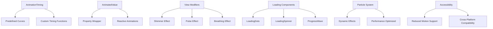

# Advanced UI/UX Implementation Guide

## Overview
This comprehensive guide provides implementation instructions for the advanced UI/UX system across all projects in the Quantum workspace. The system includes sophisticated animations, interactive components, custom transitions, and delightful micro-interactions designed to create exceptional user experiences.

## Architecture Components

### Core UI/UX Files

#### 1. AdvancedAnimations.swift
**Location**: `/Shared/UI/AdvancedAnimations.swift`
**Purpose**: Core animation system with timing functions, animated values, and performance-optimized animations
**Key Components**:
- `AnimationTiming` - Predefined easing curves and timing functions
- `AnimatedValue` property wrapper for reactive animations
- `GestureAnimations` for haptic feedback integration
- Advanced view modifiers (ShimmerEffect, PulseEffect, BreathingEffect)
- Loading animations (LoadingDots, LoadingSpinner, ProgressWave)
- Particle system for dynamic effects

#### 2. InteractiveComponents.swift
**Location**: `/Shared/UI/InteractiveComponents.swift`
**Purpose**: Interactive UI components with advanced user interactions
**Key Components**:
- `NeumorphicButton`, `GlassButton`, `FloatingActionButton` - Advanced button styles
- `InteractiveCard`, `SwipeActionCard` - Interactive card components
- `InteractiveProgressBar`, `RadialProgressIndicator` - Advanced progress displays
- `InteractiveSlider`, `InteractiveToggle` - Custom input controls
- `InteractiveTabBar` - Advanced navigation components

#### 3. CustomTransitions.swift
**Location**: `/Shared/UI/CustomTransitions.swift`
**Purpose**: Sophisticated view transitions and page effects
**Key Components**:
- Advanced transitions (slide, scale, rotate, flip, elastic, bounce)
- Geometric transitions (iris, fan, liquid, ripple)
- Page effects (page curl transition)
- `TransitionManager` for coordinated transition management

#### 4. MicroInteractions.swift
**Location**: `/Shared/UI/MicroInteractions.swift`
**Purpose**: Delightful micro-interactions and advanced gesture handling
**Key Components**:
- `MicroInteractionButton` with haptic feedback
- `PressAndHoldButton` with progress indication
- `SwipeGestureArea` with directional feedback
- Advanced gesture recognizers (pinch-to-zoom, rotation, multi-touch)
- Interactive feedback components (vibrant, magnetic buttons)

## Implementation Architecture

### Animation System Hierarchy



### Interactive Components Architecture

```mermaid
graph TD
    A[Button Components] --> B[NeumorphicButton]
    A --> C[GlassButton]
    A --> D[FloatingActionButton]
    
    E[Card Components] --> F[InteractiveCard]
    E --> G[SwipeActionCard]
    
    H[Progress Components] --> I[InteractiveProgressBar]
    H --> J[RadialProgressIndicator]
    
    K[Input Components] --> L[InteractiveSlider]
    K --> M[InteractiveToggle]
    
    N[Navigation] --> O[InteractiveTabBar]
    N --> P[TabBarItem]
    
    Q[Gesture Integration] --> R[Haptic Feedback]
    Q --> S[Visual Feedback]
    Q --> T[Audio Cues]
```



## Project-Specific Integration

### For HabitQuest

#### Habit Tracking Animations
```swift
import SwiftUI
import AdvancedAnimations
import InteractiveComponents
import MicroInteractions

struct HabitTrackerView: View {
    @State private var habits: [Habit] = []
    @State private var selectedHabit: Habit?
    @State private var showingAddHabit = false
    
    var body: some View {
        NavigationView {
            ScrollView {
                LazyVStack(spacing: 16) {
                    ForEach(habits, id: \.id) { habit in
                        HabitCard(habit: habit)
                            .slideTransition(isPresented: true, from: .trailing)
                            .animation(AnimationTiming.springBouncy.delay(Double(habits.firstIndex(of: habit) ?? 0) * 0.1), value: habits.count)
                    }
                }
                .padding()
            }
            .navigationTitle("My Habits")
            .toolbar {
                ToolbarItem(placement: .navigationBarTrailing) {
                    FloatingActionButton(
                        action: { showingAddHabit = true },
                        icon: Image(systemName: "plus"),
                        color: .green
                    )
                }
            }
        }
        .sheet(isPresented: $showingAddHabit) {
            AddHabitView()
                .scaleTransition(isPresented: showingAddHabit)
        }
    }
}

struct HabitCard: View {
    let habit: Habit
    @State private var isCompleted = false
    @State private var streak: Int = 0
    
    var body: some View {
        InteractiveCard(
            backgroundColor: isCompleted ? .green.opacity(0.1) : .gray.opacity(0.05),
            onTap: {
                completeHabit()
            },
            onLongPress: {
                showHabitDetails()
            }
        ) {
            HStack {
                VStack(alignment: .leading, spacing: 8) {
                    Text(habit.name)
                        .font(.headline)
                        .fontWeight(.semibold)
                    
                    Text("Current Streak: \(streak) days")
                        .font(.caption)
                        .foregroundColor(.secondary)
                    
                    // Progress indicator
                    RadialProgressIndicator(
                        progress: Double(streak) / 30.0,
                        size: 60,
                        foregroundColor: .green
                    )
                }
                
                Spacer()
                
                Button(action: completeHabit) {
                    Image(systemName: isCompleted ? "checkmark.circle.fill" : "circle")
                        .font(.title2)
                        .foregroundColor(isCompleted ? .green : .gray)
                }
                .microInteractionButton(
                    feedbackStyle: 1,
                    glowColor: .green
                ) {
                    completeHabit()
                }
            }
        }
        .swipeGestures(
            onSwipeLeft: {
                // Skip habit for today
                skipHabit()
            },
            onSwipeRight: {
                // Complete habit
                completeHabit()
            }
        )
    }
    
    private func completeHabit() {
        withAnimation(AnimationTiming.springBouncy) {
            isCompleted.toggle()
            if isCompleted {
                streak += 1
            }
        }
        
        // Show celebration animation
        if isCompleted {
            showCelebrationAnimation()
        }
    }
    
    private func skipHabit() {
        // Implement skip logic
    }
    
    private func showHabitDetails() {
        // Show detailed habit view
    }
    
    private func showCelebrationAnimation() {
        // Implement particle celebration
    }
}

struct AddHabitView: View {
    @Environment(\.dismiss) private var dismiss
    @State private var habitName = ""
    @State private var selectedColor: Color = .blue
    @State private var selectedIcon = "star.fill"
    
    var body: some View {
        NavigationView {
            VStack(spacing: 24) {
                // Animated header
                Text("Create New Habit")
                    .font(.largeTitle)
                    .fontWeight(.bold)
                    .shimmer()
                
                // Habit name input
                TextField("Habit name", text: $habitName)
                    .textFieldStyle(.roundedBorder)
                    .scaleEffect(habitName.isEmpty ? 1.0 : 1.02)
                    .animation(AnimationTiming.springSmooth, value: habitName.isEmpty)
                
                // Color selection
                LazyVGrid(columns: Array(repeating: GridItem(.flexible()), count: 6), spacing: 12) {
                    ForEach(habitColors, id: \.self) { color in
                        Circle()
                            .fill(color)
                            .frame(width: 44, height: 44)
                            .overlay(
                                Circle()
                                    .stroke(selectedColor == color ? .primary : .clear, lineWidth: 2)
                            )
                            .scaleEffect(selectedColor == color ? 1.2 : 1.0)
                            .onTapGesture {
                                withAnimation(AnimationTiming.springBouncy) {
                                    selectedColor = color
                                }
                            }
                    }
                }
                
                Spacer()
                
                // Create button
                NeumorphicButton(
                    action: createHabit
                ) {
                    Text("Create Habit")
                        .font(.headline)
                        .fontWeight(.semibold)
                        .foregroundColor(.white)
                        .frame(maxWidth: .infinity)
                        .padding()
                        .background(selectedColor)
                        .cornerRadius(12)
                }
                .disabled(habitName.isEmpty)
                .opacity(habitName.isEmpty ? 0.6 : 1.0)
            }
            .padding()
            .navigationBarTitleDisplayMode(.inline)
            .toolbar {
                ToolbarItem(placement: .navigationBarLeading) {
                    Button("Cancel") {
                        dismiss()
                    }
                }
            }
        }
    }
    
    private let habitColors: [Color] = [.red, .orange, .yellow, .green, .blue, .purple]
    
    private func createHabit() {
        // Create habit logic
        dismiss()
    }
}
```

### For MomentumFinance

#### Financial Dashboard Animations
```swift
struct FinancialDashboardView: View {
    @State private var accounts: [FinancialAccount] = []
    @State private var totalBalance: Double = 0
    @State private var showingDetails = false
    
    var body: some View {
        ScrollView {
            VStack(spacing: 20) {
                // Animated balance card
                BalanceCard(balance: totalBalance)
                    .scaleTransition(isPresented: true, fromScale: 0.8)
                    .animation(AnimationTiming.springBouncy.delay(0.2), value: totalBalance)
                
                // Account cards
                LazyVStack(spacing: 16) {
                    ForEach(accounts.indices, id: \.self) { index in
                        AccountCard(account: accounts[index])
                            .slideTransition(isPresented: true, from: .leading)
                            .animation(AnimationTiming.springSmooth.delay(Double(index) * 0.1), value: accounts.count)
                    }
                }
                
                // Quick actions
                QuickActionsView()
                    .bounceTransition(isPresented: true)
                    .animation(AnimationTiming.springBouncy.delay(0.5), value: accounts.count)
            }
            .padding()
        }
        .navigationTitle("Dashboard")
    }
}

struct BalanceCard: View {
    let balance: Double
    @State private var animatedBalance: Double = 0
    
    var body: some View {
        InteractiveCard(
            backgroundColor: Color.blue.opacity(0.1),
            onTap: {
                animateBalance()
            }
        ) {
            VStack(spacing: 16) {
                Text("Total Balance")
                    .font(.headline)
                    .foregroundColor(.secondary)
                
                Text("$\(animatedBalance, specifier: "%.2f")")
                    .font(.system(size: 36, weight: .bold, design: .rounded))
                    .foregroundColor(.primary)
                    .contentTransition(.numericText())
                
                // Animated progress indicator
                ProgressWave(
                    progress: animatedBalance / balance,
                    height: 8,
                    color: .blue
                )
            }
        }
        .onAppear {
            animateBalance()
        }
    }
    
    private func animateBalance() {
        withAnimation(AnimationTiming.easeOut.delay(0.3)) {
            animatedBalance = balance
        }
    }
}

struct AccountCard: View {
    let account: FinancialAccount
    @State private var showingTransactions = false
    
    var body: some View {
        InteractiveCard(
            onTap: {
                withAnimation(AnimationTiming.springBouncy) {
                    showingTransactions.toggle()
                }
            }
        ) {
            VStack(alignment: .leading, spacing: 12) {
                HStack {
                    Circle()
                        .fill(account.color)
                        .frame(width: 12, height: 12)
                        .pulse()
                    
                    Text(account.name)
                        .font(.headline)
                        .fontWeight(.semibold)
                    
                    Spacer()
                    
                    Text("$\(account.balance, specifier: "%.2f")")
                        .font(.subheadline)
                        .fontWeight(.medium)
                        .foregroundColor(.secondary)
                }
                
                if showingTransactions {
                    TransactionsList(transactions: account.recentTransactions)
                        .slideTransition(isPresented: showingTransactions, from: .top)
                }
            }
        }
        .swipeGestures(
            onSwipeLeft: {
                // Show account options
                showAccountOptions()
            },
            onSwipeRight: {
                // Quick transfer
                initiateTransfer()
            }
        )
    }
    
    private func showAccountOptions() {
        // Implement account options
    }
    
    private func initiateTransfer() {
        // Implement transfer logic
    }
}

struct QuickActionsView: View {
    let actions = [
        ("plus.circle.fill", "Add Transaction", Color.green),
        ("arrow.up.arrow.down.circle.fill", "Transfer", Color.blue),
        ("chart.bar.fill", "Analytics", Color.orange),
        ("gear.circle.fill", "Settings", Color.gray)
    ]
    
    var body: some View {
        LazyVGrid(columns: Array(repeating: GridItem(.flexible()), count: 2), spacing: 16) {
            ForEach(actions.indices, id: \.self) { index in
                let action = actions[index]
                
                VStack(spacing: 8) {
                    Image(systemName: action.0)
                        .font(.title)
                        .foregroundColor(action.2)
                        .breathing()
                    
                    Text(action.1)
                        .font(.caption)
                        .fontWeight(.medium)
                }
                .frame(maxWidth: .infinity)
                .padding()
                .background(
                    RoundedRectangle(cornerRadius: 12)
                        .fill(action.2.opacity(0.1))
                )
                .vibrantButton(vibrantColor: action.2) {
                    performAction(index)
                }
            }
        }
    }
    
    private func performAction(_ index: Int) {
        // Implement action logic
    }
}
```

### For PlannerApp

#### Task Management Interactions
```swift
struct TaskPlannerView: View {
    @State private var tasks: [Task] = []
    @State private var selectedDate = Date()
    @State private var showingTaskCreation = false
    
    var body: some View {
        VStack(spacing: 0) {
            // Date picker with smooth transitions
            DatePickerView(selectedDate: $selectedDate)
                .slideTransition(isPresented: true, from: .top)
            
            Divider()
            
            // Tasks list with staggered animations
            ScrollView {
                LazyVStack(spacing: 16) {
                    ForEach(tasks.indices, id: \.self) { index in
                        TaskCard(task: tasks[index])
                            .scaleTransition(
                                isPresented: true,
                                fromScale: 0.9,
                                anchor: .leading
                            )
                            .animation(
                                AnimationTiming.springBouncy.delay(Double(index) * 0.05),
                                value: tasks.count
                            )
                    }
                }
                .padding()
            }
        }
        .navigationTitle("Planner")
        .toolbar {
            ToolbarItem(placement: .navigationBarTrailing) {
                FloatingActionButton(
                    action: { showingTaskCreation = true },
                    icon: Image(systemName: "plus"),
                    color: .blue
                )
            }
        }
        .sheet(isPresented: $showingTaskCreation) {
            TaskCreationView()
                .irisTransition(isPresented: showingTaskCreation)
        }
    }
}

struct TaskCard: View {
    let task: Task
    @State private var isCompleted = false
    @State private var dragOffset: CGFloat = 0
    
    var body: some View {
        InteractiveCard(
            backgroundColor: isCompleted ? .green.opacity(0.1) : .white,
            onLongPress: {
                showTaskOptions()
            }
        ) {
            HStack(spacing: 16) {
                // Completion button
                Button(action: toggleCompletion) {
                    Image(systemName: isCompleted ? "checkmark.circle.fill" : "circle")
                        .font(.title2)
                        .foregroundColor(isCompleted ? .green : .gray)
                }
                .pressAndHoldButton(duration: 1.5) { progress in
                    // Show progress
                } onComplete: {
                    toggleCompletion()
                }
                
                VStack(alignment: .leading, spacing: 4) {
                    Text(task.title)
                        .font(.headline)
                        .strikethrough(isCompleted)
                        .foregroundColor(isCompleted ? .secondary : .primary)
                    
                    if let description = task.description {
                        Text(description)
                            .font(.caption)
                            .foregroundColor(.secondary)
                            .lineLimit(2)
                    }
                    
                    // Priority indicator
                    HStack(spacing: 4) {
                        ForEach(0..<task.priority.rawValue, id: \.self) { _ in
                            Circle()
                                .fill(priorityColor(task.priority))
                                .frame(width: 6, height: 6)
                                .pulse()
                        }
                    }
                }
                
                Spacer()
                
                // Time indicator
                if let dueTime = task.dueTime {
                    Text(dueTime, style: .time)
                        .font(.caption)
                        .fontWeight(.medium)
                        .padding(.horizontal, 8)
                        .padding(.vertical, 4)
                        .background(
                            Capsule()
                                .fill(Color.blue.opacity(0.2))
                        )
                }
            }
        }
        .dragToReveal(threshold: 80) {
            completeTask()
        }
        .multiTouchGestures(
            onDoubleTap: {
                quickEdit()
            },
            onTripleTap: {
                duplicateTask()
            }
        )
    }
    
    private func toggleCompletion() {
        withAnimation(AnimationTiming.springBouncy) {
            isCompleted.toggle()
        }
        
        if isCompleted {
            showCompletionCelebration()
        }
    }
    
    private func showTaskOptions() {
        // Show task context menu
    }
    
    private func completeTask() {
        withAnimation(AnimationTiming.springBouncy) {
            isCompleted = true
        }
    }
    
    private func quickEdit() {
        // Show quick edit interface
    }
    
    private func duplicateTask() {
        // Duplicate task logic
    }
    
    private func showCompletionCelebration() {
        // Show celebration animation
    }
    
    private func priorityColor(_ priority: TaskPriority) -> Color {
        switch priority {
        case .low: return .green
        case .medium: return .orange
        case .high: return .red
        }
    }
}

struct TaskCreationView: View {
    @Environment(\.dismiss) private var dismiss
    @State private var title = ""
    @State private var description = ""
    @State private var selectedPriority: TaskPriority = .medium
    @State private var dueDate = Date()
    @State private var showDatePicker = false
    
    var body: some View {
        NavigationView {
            VStack(spacing: 24) {
                // Animated progress indicator
                ProgressIndicator(currentStep: calculateStep(), totalSteps: 4)
                    .animation(AnimationTiming.springSmooth, value: calculateStep())
                
                VStack(spacing: 16) {
                    // Title input
                    TextField("Task title", text: $title)
                        .textFieldStyle(.roundedBorder)
                        .scaleEffect(title.isEmpty ? 1.0 : 1.02)
                        .animation(AnimationTiming.springSmooth, value: title.isEmpty)
                    
                    // Description input
                    TextField("Description (optional)", text: $description)
                        .textFieldStyle(.roundedBorder)
                    
                    // Priority selector
                    PrioritySelector(selectedPriority: $selectedPriority)
                    
                    // Due date
                    Button(action: { showDatePicker.toggle() }) {
                        HStack {
                            Image(systemName: "calendar")
                            Text("Due: \(dueDate, style: .date)")
                            Spacer()
                            Image(systemName: "chevron.right")
                        }
                        .padding()
                        .background(Color.gray.opacity(0.1))
                        .cornerRadius(8)
                    }
                }
                
                Spacer()
                
                // Create button
                NeumorphicButton(action: createTask) {
                    Text("Create Task")
                        .font(.headline)
                        .fontWeight(.semibold)
                        .foregroundColor(.white)
                        .frame(maxWidth: .infinity)
                        .padding()
                        .background(Color.blue)
                        .cornerRadius(12)
                }
                .disabled(title.isEmpty)
                .opacity(title.isEmpty ? 0.6 : 1.0)
            }
            .padding()
            .navigationTitle("New Task")
            .navigationBarTitleDisplayMode(.inline)
            .toolbar {
                ToolbarItem(placement: .navigationBarLeading) {
                    Button("Cancel") {
                        dismiss()
                    }
                }
            }
        }
        .sheet(isPresented: $showDatePicker) {
            DatePicker("Due Date", selection: $dueDate, displayedComponents: [.date, .hourAndMinute])
                .datePickerStyle(.wheel)
                .presentationDetents([.medium])
        }
    }
    
    private func calculateStep() -> Int {
        var step = 0
        if !title.isEmpty { step += 1 }
        if !description.isEmpty { step += 1 }
        if selectedPriority != .medium { step += 1 }
        if dueDate != Date() { step += 1 }
        return step
    }
    
    private func createTask() {
        // Create task logic
        dismiss()
    }
}

struct PrioritySelector: View {
    @Binding var selectedPriority: TaskPriority
    
    var body: some View {
        HStack(spacing: 12) {
            Text("Priority:")
                .font(.subheadline)
                .fontWeight(.medium)
            
            ForEach(TaskPriority.allCases, id: \.self) { priority in
                Button(action: {
                    withAnimation(AnimationTiming.springBouncy) {
                        selectedPriority = priority
                    }
                }) {
                    Text(priority.displayName)
                        .font(.caption)
                        .fontWeight(.semibold)
                        .padding(.horizontal, 12)
                        .padding(.vertical, 6)
                        .background(
                            Capsule()
                                .fill(selectedPriority == priority ? priority.color : Color.gray.opacity(0.2))
                        )
                        .foregroundColor(selectedPriority == priority ? .white : .primary)
                        .scaleEffect(selectedPriority == priority ? 1.1 : 1.0)
                }
                .buttonStyle(PlainButtonStyle())
            }
        }
    }
}
```

### For CodingReviewer

#### Code Review Interface
```swift
struct CodeReviewDashboard: View {
    @State private var pullRequests: [PullRequest] = []
    @State private var selectedFilter: ReviewFilter = .all
    @State private var showingFilters = false
    
    var body: some View {
        NavigationView {
            VStack(spacing: 0) {
                // Filter bar with smooth transitions
                FilterBar(selectedFilter: $selectedFilter, showingFilters: $showingFilters)
                    .slideTransition(isPresented: true, from: .top)
                
                // Pull requests list
                ScrollView {
                    LazyVStack(spacing: 16) {
                        ForEach(pullRequests.indices, id: \.self) { index in
                            PullRequestCard(pr: pullRequests[index])
                                .slideTransition(isPresented: true, from: .trailing)
                                .animation(
                                    AnimationTiming.springSmooth.delay(Double(index) * 0.05),
                                    value: pullRequests.count
                                )
                        }
                    }
                    .padding()
                }
            }
            .navigationTitle("Code Reviews")
            .toolbar {
                ToolbarItem(placement: .navigationBarTrailing) {
                    Button(action: { showingFilters.toggle() }) {
                        Image(systemName: "line.horizontal.3.decrease.circle")
                            .font(.title2)
                    }
                    .rotationTransition(isPresented: showingFilters, degrees: 180)
                }
            }
        }
    }
}

struct PullRequestCard: View {
    let pr: PullRequest
    @State private var showingDetails = false
    @State private var approvalProgress: Double = 0
    
    var body: some View {
        InteractiveCard(
            backgroundColor: statusColor.opacity(0.05),
            onTap: {
                showDetails()
            },
            onLongPress: {
                showQuickActions()
            }
        ) {
            VStack(alignment: .leading, spacing: 12) {
                // Header
                HStack {
                    VStack(alignment: .leading, spacing: 4) {
                        Text(pr.title)
                            .font(.headline)
                            .fontWeight(.semibold)
                            .lineLimit(2)
                        
                        Text("by \(pr.author) • \(pr.createdAt, style: .relative)")
                            .font(.caption)
                            .foregroundColor(.secondary)
                    }
                    
                    Spacer()
                    
                    StatusBadge(status: pr.status)
                }
                
                // Metrics
                HStack(spacing: 16) {
                    MetricView(
                        icon: "plus.circle.fill",
                        value: "+\(pr.additions)",
                        color: .green
                    )
                    
                    MetricView(
                        icon: "minus.circle.fill",
                        value: "-\(pr.deletions)",
                        color: .red
                    )
                    
                    MetricView(
                        icon: "doc.text.fill",
                        value: "\(pr.filesChanged)",
                        color: .blue
                    )
                    
                    Spacer()
                }
                
                // Review progress
                if pr.reviewersRequired > 0 {
                    HStack {
                        Text("Approvals")
                            .font(.caption)
                            .foregroundColor(.secondary)
                        
                        Spacer()
                        
                        CircularProgress(
                            progress: Double(pr.approvals) / Double(pr.reviewersRequired),
                            lineWidth: 4,
                            foregroundColor: .green
                        )
                        .frame(width: 24, height: 24)
                    }
                }
            }
        }
        .swipeGestures(
            onSwipeLeft: {
                // Request changes
                requestChanges()
            },
            onSwipeRight: {
                // Approve
                approve()
            }
        )
        .contextMenu {
            ContextMenuContent(pr: pr)
        }
    }
    
    private var statusColor: Color {
        switch pr.status {
        case .draft: return .gray
        case .open: return .blue
        case .approved: return .green
        case .changesRequested: return .orange
        case .merged: return .purple
        case .closed: return .red
        }
    }
    
    private func showDetails() {
        withAnimation(AnimationTiming.springBouncy) {
            showingDetails = true
        }
    }
    
    private func showQuickActions() {
        // Show quick action menu
    }
    
    private func approve() {
        withAnimation(AnimationTiming.springBouncy) {
            // Approval logic
        }
        
        // Show approval animation
        showApprovalAnimation()
    }
    
    private func requestChanges() {
        withAnimation(AnimationTiming.springBouncy) {
            // Request changes logic
        }
    }
    
    private func showApprovalAnimation() {
        // Implement approval celebration
    }
}

struct StatusBadge: View {
    let status: PRStatus
    
    var body: some View {
        Text(status.displayName)
            .font(.caption)
            .fontWeight(.semibold)
            .padding(.horizontal, 8)
            .padding(.vertical, 4)
            .background(
                Capsule()
                    .fill(statusColor)
            )
            .foregroundColor(.white)
            .pulse(scale: 1.05, duration: 2.0)
    }
    
    private var statusColor: Color {
        switch status {
        case .draft: return .gray
        case .open: return .blue
        case .approved: return .green
        case .changesRequested: return .orange
        case .merged: return .purple
        case .closed: return .red
        }
    }
}

struct MetricView: View {
    let icon: String
    let value: String
    let color: Color
    
    var body: some View {
        HStack(spacing: 4) {
            Image(systemName: icon)
                .font(.caption)
                .foregroundColor(color)
            
            Text(value)
                .font(.caption)
                .fontWeight(.medium)
                .foregroundColor(color)
        }
        .breathing()
    }
}
```

### For AvoidObstaclesGame

#### Game Interface Animations
```swift
struct GameView: View {
    @StateObject private var gameEngine = GameEngine()
    @State private var showingPauseMenu = false
    @State private var score: Int = 0
    @State private var gameState: GameState = .playing
    
    var body: some View {
        ZStack {
            // Game background with particles
            GameBackgroundView()
                .fluidInteraction { type, location in
                    handleBackgroundInteraction(type, location)
                }
            
            // Game elements
            GameElementsView(gameEngine: gameEngine)
                .scaleEffect(gameState == .paused ? 0.95 : 1.0)
                .blur(radius: gameState == .paused ? 2 : 0)
            
            // HUD
            GameHUDView(score: score, onPause: pauseGame)
                .slideTransition(isPresented: true, from: .top)
            
            // Pause menu
            if showingPauseMenu {
                PauseMenuView(onResume: resumeGame, onRestart: restartGame)
                    .irisTransition(isPresented: showingPauseMenu, center: .center)
            }
            
            // Game over screen
            if gameState == .gameOver {
                GameOverView(score: score, onRestart: restartGame)
                    .rippleTransition(isPresented: gameState == .gameOver)
            }
        }
        .animation(AnimationTiming.springSmooth, value: gameState)
        .onChange(of: gameEngine.score) { newScore in
            withAnimation(AnimationTiming.springBouncy) {
                score = newScore
            }
        }
    }
    
    private func pauseGame() {
        withAnimation(AnimationTiming.springBouncy) {
            gameState = .paused
            showingPauseMenu = true
        }
        gameEngine.pauseGame()
    }
    
    private func resumeGame() {
        withAnimation(AnimationTiming.springBouncy) {
            gameState = .playing
            showingPauseMenu = false
        }
        gameEngine.resumeGame()
    }
    
    private func restartGame() {
        withAnimation(AnimationTiming.springBouncy) {
            gameState = .playing
            showingPauseMenu = false
            score = 0
        }
        gameEngine.restartGame()
    }
    
    private func handleBackgroundInteraction(_ type: InteractionType, _ location: CGPoint) {
        switch type {
        case .tap:
            gameEngine.handleTap(at: location)
        case .drag:
            gameEngine.handleDrag(at: location)
        case .end:
            gameEngine.handleDragEnd()
        }
    }
}

struct GameBackgroundView: View {
    @State private var stars: [Star] = []
    
    var body: some View {
        ZStack {
            // Gradient background
            AnimatedGradient(
                colors: [.black, .blue.opacity(0.3), .purple.opacity(0.2)],
                speed: 0.5
            )
            
            // Particle stars
            ParticleSystem(
                particleCount: 100,
                emissionRate: 0.2,
                particleLifetime: 5.0,
                particleSize: 2,
                particleColor: .white
            )
        }
        .ignoresSafeArea()
    }
}

struct GameElementsView: View {
    @ObservedObject var gameEngine: GameEngine
    
    var body: some View {
        ZStack {
            // Player
            PlayerView(player: gameEngine.player)
                .scaleEffect(gameEngine.player.isInvulnerable ? 1.2 : 1.0)
                .opacity(gameEngine.player.isInvulnerable ? 0.7 : 1.0)
                .animation(
                    gameEngine.player.isInvulnerable 
                        ? Animation.easeInOut(duration: 0.2).repeatForever(autoreverses: true)
                        : AnimationTiming.springSmooth,
                    value: gameEngine.player.isInvulnerable
                )
            
            // Obstacles
            ForEach(gameEngine.obstacles, id: \.id) { obstacle in
                ObstacleView(obstacle: obstacle)
                    .slideTransition(isPresented: true, from: .trailing)
            }
            
            // Power-ups
            ForEach(gameEngine.powerUps, id: \.id) { powerUp in
                PowerUpView(powerUp: powerUp)
                    .bounceTransition(isPresented: true)
                    .shimmer()
            }
            
            // Collectibles
            ForEach(gameEngine.collectibles, id: \.id) { collectible in
                CollectibleView(collectible: collectible)
                    .pulse()
                    .rotationTransition(isPresented: true, degrees: 360)
            }
        }
    }
}

struct GameHUDView: View {
    let score: Int
    let onPause: () -> Void
    
    @State private var displayedScore: Int = 0
    
    var body: some View {
        VStack {
            HStack {
                // Score
                VStack(alignment: .leading) {
                    Text("SCORE")
                        .font(.caption)
                        .fontWeight(.bold)
                        .foregroundColor(.white.opacity(0.8))
                    
                    Text("\(displayedScore)")
                        .font(.title)
                        .fontWeight(.bold)
                        .foregroundColor(.white)
                        .contentTransition(.numericText())
                }
                
                Spacer()
                
                // Pause button
                Button(action: onPause) {
                    Image(systemName: "pause.fill")
                        .font(.title2)
                        .foregroundColor(.white)
                        .frame(width: 44, height: 44)
                        .background(
                            Circle()
                                .fill(Color.white.opacity(0.2))
                                .background(.ultraThinMaterial, in: Circle())
                        )
                }
                .vibrantButton(vibrantColor: .white, action: onPause)
            }
            
            Spacer()
        }
        .padding()
        .onChange(of: score) { newScore in
            withAnimation(AnimationTiming.springBouncy) {
                displayedScore = newScore
            }
        }
    }
}

struct PauseMenuView: View {
    let onResume: () -> Void
    let onRestart: () -> Void
    
    var body: some View {
        VStack(spacing: 24) {
            Text("PAUSED")
                .font(.largeTitle)
                .fontWeight(.bold)
                .foregroundColor(.white)
                .shimmer()
            
            VStack(spacing: 16) {
                NeumorphicButton(action: onResume) {
                    Text("Resume")
                        .font(.headline)
                        .fontWeight(.semibold)
                        .foregroundColor(.white)
                        .frame(maxWidth: .infinity)
                        .padding()
                        .background(Color.green)
                        .cornerRadius(12)
                }
                
                NeumorphicButton(action: onRestart) {
                    Text("Restart")
                        .font(.headline)
                        .fontWeight(.semibold)
                        .foregroundColor(.white)
                        .frame(maxWidth: .infinity)
                        .padding()
                        .background(Color.orange)
                        .cornerRadius(12)
                }
                
                NeumorphicButton(action: {}) {
                    Text("Main Menu")
                        .font(.headline)
                        .fontWeight(.semibold)
                        .foregroundColor(.white)
                        .frame(maxWidth: .infinity)
                        .padding()
                        .background(Color.red)
                        .cornerRadius(12)
                }
            }
        }
        .padding()
        .background(
            RoundedRectangle(cornerRadius: 20)
                .fill(Color.black.opacity(0.8))
                .background(.ultraThinMaterial, in: RoundedRectangle(cornerRadius: 20))
        )
        .padding()
    }
}
```

## Best Practices and Performance Guidelines

### 1. Animation Performance
- **GPU Acceleration**: Use transform-based animations (scale, rotation, translation) for best performance
- **Avoid Layout Changes**: Minimize animations that trigger layout recalculation
- **Batch Animations**: Group related animations to reduce computational overhead
- **Frame Rate Optimization**: Target 60fps for smooth user experience

### 2. Memory Management
- **State Management**: Use @State and @StateObject appropriately to avoid memory leaks
- **Timer Cleanup**: Always invalidate timers and cancel subscriptions in cleanup
- **Image Optimization**: Use appropriate image sizes and caching strategies
- **Animation Disposal**: Remove animations when views are deallocated

### 3. Accessibility Considerations
- **Reduced Motion**: Respect system reduce motion settings
- **Voice Over**: Provide appropriate accessibility labels and hints
- **Color Contrast**: Ensure sufficient contrast for visual elements
- **Focus Management**: Handle focus changes appropriately for navigation

### 4. Cross-Platform Compatibility
- **Platform-Specific Features**: Use conditional compilation for platform-specific code
- **Device Capabilities**: Adapt animations based on device performance
- **Screen Sizes**: Design responsive layouts for different screen sizes
- **Input Methods**: Support both touch and mouse/trackpad inputs

### 5. User Experience Guidelines
- **Meaningful Motion**: Use animations to provide context and feedback
- **Consistency**: Maintain consistent animation timing and easing throughout the app
- **Interruption Handling**: Allow users to interrupt animations when appropriate
- **Performance Feedback**: Provide visual feedback for long-running operations

### 6. Testing and Validation
- **Performance Profiling**: Use Instruments to monitor animation performance
- **Device Testing**: Test on various devices and iOS versions
- **User Testing**: Validate animations enhance rather than distract from user tasks
- **Accessibility Testing**: Verify animations work with accessibility features

## Deployment and Integration

### Development Workflow
1. **Component Development**: Build individual animated components
2. **Integration Testing**: Test components in context of specific projects
3. **Performance Optimization**: Profile and optimize for target devices
4. **User Testing**: Validate user experience improvements
5. **Documentation**: Document component APIs and usage patterns
6. **Deployment**: Integrate across all projects with consistent implementation

### Monitoring and Analytics
- **Animation Performance Metrics**: Track frame rates and animation completion times
- **User Interaction Analytics**: Monitor user engagement with interactive components
- **Crash Reporting**: Monitor for animation-related crashes or performance issues
- **A/B Testing**: Test different animation approaches for user preference

### Maintenance and Updates
- **Regular Performance Reviews**: Monitor animation performance across iOS updates
- **Component Updates**: Keep animation library updated with latest SwiftUI capabilities
- **User Feedback Integration**: Incorporate user feedback for animation improvements
- **Platform Adaptation**: Adapt animations for new iOS features and capabilities

This comprehensive Advanced UI/UX Implementation provides the foundation for exceptional user experiences across all projects in the Quantum workspace, with sophisticated animations, delightful micro-interactions, and performance-optimized components that create truly engaging applications.